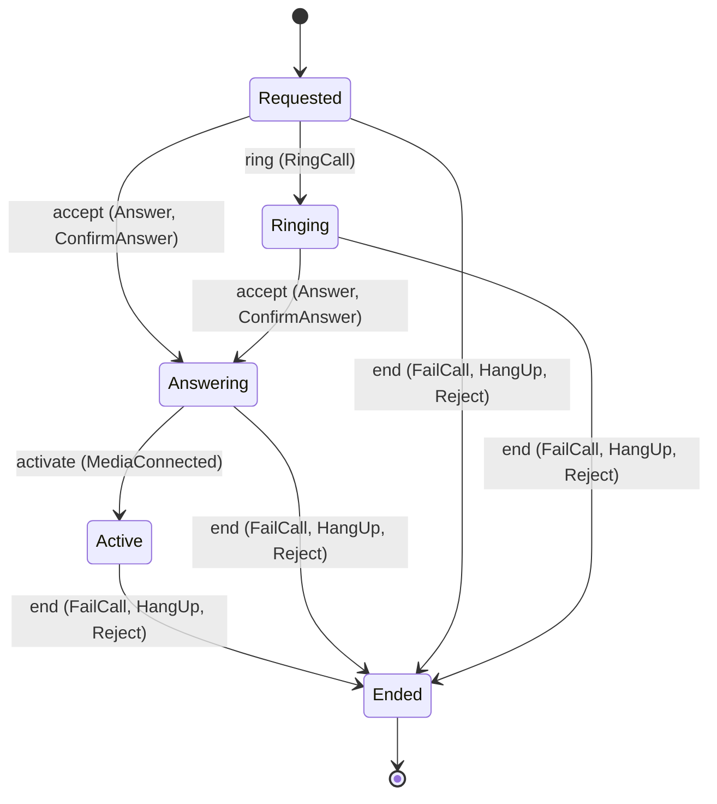
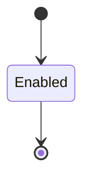

<!--
generated from softphone v1
model digest aba1da1149fb1642c433b23af295d777adcc159bd748b60ca1a5d9a812a4becf
contract digest 913760e973be00acd471682b61f976e01adb4da95f8c410d040f7c82c85b7f98
do not edit: regenerate with `ess generate`
-->

# Phone control

Calls this phone is placing or receiving, and the commands a human or an agent issues identically to drive them. No protocol type and no contact appears here.

`softphone.control` is one of softphone's bounded contexts. [Back to the index](../index.md).

## Types

### `CallDirection`

`softphone.control.CallDirection` is one of `Outbound` and `Inbound`.

### `CallId`

`softphone.control.CallId` wraps `Uuid` and is not interchangeable with one: the whole value of naming it separately is the crossings the model then refuses.

### `CallRow`

`softphone.control.CallRow` is a record of seven fields:

- `call_id` — `softphone.control.CallId`
- `endpoint_id` — `softphone.control.EndpointId`
- `direction` — `softphone.control.CallDirection`
- `remote` — `softphone.control.RemoteAddress`
- `session_id` — `Optional<softphone.media.MediaSessionId>`, which may be absent
- `muted` — `Boolean`
- `state` — `softphone.control.Call.State`

### `DigitString`

`softphone.control.DigitString` wraps `String` and is not interchangeable with one: the whole value of naming it separately is the crossings the model then refuses.

### `EndCause`

`softphone.control.EndCause` is one of `Local`, `Remote`, `Refused`, `Sip`, `Media` and `Timeout`.

### `EndpointId`

`softphone.control.EndpointId` wraps `Uuid` and is not interchangeable with one: the whole value of naming it separately is the crossings the model then refuses.

### `EndpointRow`

`softphone.control.EndpointRow` is a record of four fields:

- `endpoint_id` — `softphone.control.EndpointId`
- `label` — `String`
- `default_binding` — `softphone.media.BindingKind`
- `state` — `softphone.control.PhoneEndpoint.State`

### `RejectStatus`

`softphone.control.RejectStatus` wraps `Integer` and is not interchangeable with one: the whole value of naming it separately is the crossings the model then refuses.

### `RemoteAddress`

`softphone.control.RemoteAddress` wraps `String` and is not interchangeable with one: the whole value of naming it separately is the crossings the model then refuses.

Two of the types above are reached by nothing else in this system: `softphone.control.CallRow` and `softphone.control.EndpointRow`. No entity, view, command, event, error or crossing names them, so it is either vocabulary something outside this specification uses or a leftover — and only a person can tell which.

## Entities

An entity is what this context is about: something with an identity that outlives any one request, a shape, and a lifecycle. The lifecycle is exhaustive — a move that is not drawn below is a move this specification does not permit, and that is the only way it says so. Every move is labelled with the command that takes it, because a move nothing can trigger is refused rather than drawn.

### `Call`

`softphone.control.Call`.

An instance is identified by `call_id`, a `softphone.control.CallId`. The name is part of the model and not a convention: a view projects the identity under that name, so a projection inventing its own would disagree with the view.

It holds:

- `endpoint_id` — `softphone.control.EndpointId`
- `direction` — `softphone.control.CallDirection`
- `remote` — `softphone.control.RemoteAddress`
- `session_id` — `Optional<softphone.media.MediaSessionId>`, which may be absent
- `muted` — `Boolean`

It references at most one [`softphone.media.MediaSession`](softphone-media.md#mediasession), as `media`, carried by `Call.session_id`.

Every instance satisfies `(not (state == Active) or defined(session_id))` — a predicate over this entity's own fields, checked against them rather than stored as a sentence, so an invariant reading something the entity does not have is refused instead of documented.

Its state is a `softphone.control.Call.State`, one of `Active`, `Answering`, `Ended`, `Requested` and `Ringing`. That enum is synthesised from the lifecycle rather than declared beside it, so the states a view's filter compares and the states drawn below cannot disagree.

An instance is created in `Requested`. `Ended` is terminal, so an instance may rest there forever. That is declared rather than inferred from having no way out: an entity that cannot leave a state is either finished or stuck, and only its author knows which.

Each move is taken by a declared command outcome, and a move nothing takes is refused as `missing_causation` rather than left as a state change nobody can trigger:

- `ring` — taken by `softphone.control.RingCall` on its `ringing` outcome
- `accept` — taken by `softphone.control.Answer` on its `answered` outcome and `softphone.control.ConfirmAnswer` on its `confirmed` outcome
- `activate` — taken by `softphone.control.MediaConnected` on its `established` outcome
- `end` — taken by `softphone.control.FailCall` on its `failed` outcome, `softphone.control.HangUp` on its `hung-up` outcome and `softphone.control.Reject` on its `rejected` outcome

An instance is brought into existence by `softphone.control.Dial` on its `dialled` outcome and `softphone.control.OfferCall` on its `offered` outcome.

Illegal transitions are illegal by absence: no rule forbids them, there is simply no arrow, because a rule would be a second place for the same truth to live. A diagram cannot show an absence, so the pairs it does not connect are listed here, derived from the same transitions — anything named below is a move this specification does not permit.

- `Active` may not become `Answering`
- `Active` may not become `Requested`
- `Active` may not become `Ringing`
- `Answering` may not become `Requested`
- `Answering` may not become `Ringing`
- `Ended` may not become `Active`
- `Ended` may not become `Answering`
- `Ended` may not become `Requested`
- `Ended` may not become `Ringing`
- `Requested` may not become `Active`
- `Ringing` may not become `Active`
- `Ringing` may not become `Requested`

Two views project it: [`ActiveCalls`](#activecalls) and [`CallById`](#callbyid).

### `PhoneEndpoint`

`softphone.control.PhoneEndpoint`.

An instance is identified by `endpoint_id`, a `softphone.control.EndpointId`. The name is part of the model and not a convention: a view projects the identity under that name, so a projection inventing its own would disagree with the view.

It holds:

- `label` — `String`
- `default_binding` — `softphone.media.BindingKind`

It declares no relation to another entity, and no other entity names it.

No invariant is declared, so nothing here constrains an instance at rest.

Its state is a `softphone.control.PhoneEndpoint.State`, one of `Enabled`. That enum is synthesised from the lifecycle rather than declared beside it, so the states a view's filter compares and the states drawn below cannot disagree.

An instance is created in `Enabled`. `Enabled` is terminal, so an instance may rest there forever. That is declared rather than inferred from having no way out: an entity that cannot leave a state is either finished or stuck, and only its author knows which.

It declares no moves, so nothing changes its state once it exists.

It has one state, so there is no move to permit or to forbid.

One view projects it: [`EndpointById`](#endpointbyid).

## Views

A view is what the outside world is promised it can observe. Each one says which instances it contains and how soon it reflects a command that has already returned, because "you can read this" without "how soon" is the promise every flaky suite is built on.

### `ActiveCalls`

`softphone.control.ActiveCalls`, shown to a person as "Active calls" and called `active-calls` on the wire.

It reads [`Call`](#call).

It contains the instances where `state == Active` holds, and only those — so an instance a caller cannot find in here has been filtered out rather than lost.

It exposes:

- `call_id` — `softphone.control.CallId`
- `endpoint_id` — `softphone.control.EndpointId`
- `direction` — `softphone.control.CallDirection`
- `remote` — `softphone.control.RemoteAddress`
- `session_id` — `Optional<softphone.media.MediaSessionId>`, which may be absent
- `muted` — `Boolean`
- `state` — `softphone.control.Call.State`

It declares no order, so the rows come back in whatever order the implementation has, and two reads may disagree.

**Read-your-writes**: it is current the moment the command that changed it returns. A caller that has just created an invoice and cannot see it in here has been told a lie about what it did.

A generated scenario asserts it once, immediately after the command: a view promising this and not keeping the promise has to fail the suite rather than be retried until it passes.

### `CallById`

`softphone.control.CallById`, shown to a person as "Call by id" and called `call-by-id` on the wire.

It reads [`Call`](#call).

It contains the instances where `call_id == param.call_id` holds, and only those — so an instance a caller cannot find in here has been filtered out rather than lost.

It exposes:

- `call_id` — `softphone.control.CallId`
- `endpoint_id` — `softphone.control.EndpointId`
- `direction` — `softphone.control.CallDirection`
- `remote` — `softphone.control.RemoteAddress`
- `session_id` — `Optional<softphone.media.MediaSessionId>`, which may be absent
- `muted` — `Boolean`
- `state` — `softphone.control.Call.State`

It declares no order, so the rows come back in whatever order the implementation has, and two reads may disagree.

**Read-your-writes**: it is current the moment the command that changed it returns. A caller that has just created an invoice and cannot see it in here has been told a lie about what it did.

A generated scenario asserts it once, immediately after the command: a view promising this and not keeping the promise has to fail the suite rather than be retried until it passes.

### `EndpointById`

`softphone.control.EndpointById`, shown to a person as "Endpoint by id" and called `endpoint-by-id` on the wire.

It reads [`PhoneEndpoint`](#phoneendpoint).

It contains the instances where `endpoint_id == param.endpoint_id` holds, and only those — so an instance a caller cannot find in here has been filtered out rather than lost.

It exposes:

- `endpoint_id` — `softphone.control.EndpointId`
- `label` — `String`
- `default_binding` — `softphone.media.BindingKind`
- `state` — `softphone.control.PhoneEndpoint.State`

It declares no order, so the rows come back in whatever order the implementation has, and two reads may disagree.

**Read-your-writes**: it is current the moment the command that changed it returns. A caller that has just created an invoice and cannot see it in here has been told a lie about what it did.

A generated scenario asserts it once, immediately after the command: a view promising this and not keeping the promise has to fail the suite rather than be retried until it passes.

## Commands

### `Answer`

`softphone.control.Answer`, shown to a person as "Answer" and called `answer` on the wire.

It takes:

- `call_id` — `softphone.control.CallId`

It has two outcomes.

**`answered`** — The default branch, taken when no other outcome's condition matched. It moves a `softphone.control.Call` from `Requested` and `Ringing` to `Answering`, along the declared move `accept`. The instance is the one named by the input field `call_id`. It emits `softphone.control.CallAnswered`. A test reaches it by constructing an input that satisfies no other outcome's condition.

**`wrong-state`** — Taken when the subject is resting in a state none of this command's moves start from — a `softphone.control.Call` in `Active`, `Answering` and `Ended`, which is what is left of the lifecycle once this command's own moves are taken away. The document lists none of it. No entity in this specification changes. It reports `softphone.control.CallStateConflict`, carrying `state`. It emits nothing. A test reaches it by driving an instance into one of those states and then issuing the command, because no input selects this branch.

### `AttachMedia`

`softphone.control.AttachMedia`, shown to a person as "Attach media" and called `attach-media` on the wire.

It takes:

- `call_id` — `softphone.control.CallId`
- `session_id` — `softphone.media.MediaSessionId`

It has one outcome.

**`attached`** — The default branch, taken when no other outcome's condition matched. It changes a `softphone.control.Call` without moving it along its lifecycle. The instance is the one named by the input field `call_id`. It emits `softphone.control.MediaAttached`. It sets `session_id` from `input.session_id`. A test reaches it by constructing an input that satisfies no other outcome's condition.

### `ConfigureEndpoint`

`softphone.control.ConfigureEndpoint`, shown to a person as "Configure endpoint" and called `configure-endpoint` on the wire.

It takes:

- `label` — `String`
- `default_binding` — `softphone.media.BindingKind`

It has one outcome.

**`configured`** — The default branch, taken when no other outcome's condition matched. It creates a `softphone.control.PhoneEndpoint`, which starts in `Enabled`. The new instance's identity is published as `endpoint_id` on `softphone.control.EndpointConfigured`. It emits `softphone.control.EndpointConfigured`. It sets `label` from `input.label` and `default_binding` from `input.default_binding`. A test reaches it by constructing an input that satisfies no other outcome's condition.

### `ConfirmAnswer`

`softphone.control.ConfirmAnswer`, shown to a person as "Confirm answer" and called `confirm-answer` on the wire.

It takes:

- `call_id` — `softphone.control.CallId`

It has two outcomes.

**`confirmed`** — The default branch, taken when no other outcome's condition matched. It moves a `softphone.control.Call` from `Requested` and `Ringing` to `Answering`, along the declared move `accept`. The instance is the one named by the input field `call_id`. It emits `softphone.control.CallConfirmed`. A test reaches it by constructing an input that satisfies no other outcome's condition.

**`wrong-state`** — Taken when the subject is resting in a state none of this command's moves start from — a `softphone.control.Call` in `Active`, `Answering` and `Ended`, which is what is left of the lifecycle once this command's own moves are taken away. The document lists none of it. No entity in this specification changes. It reports `softphone.control.CallStateConflict`, carrying `state`. It emits nothing. A test reaches it by driving an instance into one of those states and then issuing the command, because no input selects this branch.

### `Dial`

`softphone.control.Dial`, shown to a person as "Dial" and called `dial` on the wire.

It takes:

- `endpoint_id` — `softphone.control.EndpointId`
- `remote` — `softphone.control.RemoteAddress`

It has one outcome.

**`dialled`** — The call is Requested and Outbound; no media exists yet, so `session_id` is absent. The default branch, taken when no other outcome's condition matched. It creates a `softphone.control.Call`, which starts in `Requested`. The new instance's identity is published as `call_id` on `softphone.control.CallDialled`. It emits `softphone.control.CallDialled`. It sets `endpoint_id` from `input.endpoint_id`, `direction` from `"Outbound"`, `remote` from `input.remote` and `muted` from `"false"`. A test reaches it by constructing an input that satisfies no other outcome's condition.

### `FailCall`

`softphone.control.FailCall`, shown to a person as "Fail call" and called `fail-call` on the wire.

Recorded at `sipx:docs/specs/browser-sdk.md#L365`.

It takes:

- `call_id` — `softphone.control.CallId`
- `cause` — `softphone.control.EndCause`

It has two outcomes.

**`failed`** — The default branch, taken when no other outcome's condition matched. It moves a `softphone.control.Call` from `Active`, `Answering`, `Requested` and `Ringing` to `Ended`, along the declared move `end`. The instance is the one named by the input field `call_id`. It emits `softphone.control.CallFailed`. A test reaches it by constructing an input that satisfies no other outcome's condition.

**`wrong-state`** — Taken when the subject is resting in a state none of this command's moves start from — a `softphone.control.Call` in `Ended`, which is what is left of the lifecycle once this command's own moves are taken away. The document lists none of it. No entity in this specification changes. It reports `softphone.control.CallStateConflict`, carrying `state`. It emits nothing. A test reaches it by driving an instance into one of those states and then issuing the command, because no input selects this branch.

### `HangUp`

`softphone.control.HangUp`, shown to a person as "Hang up" and called `hang-up` on the wire.

It takes:

- `call_id` — `softphone.control.CallId`

It has two outcomes.

**`hung-up`** — The default branch, taken when no other outcome's condition matched. It moves a `softphone.control.Call` from `Active`, `Answering`, `Requested` and `Ringing` to `Ended`, along the declared move `end`. The instance is the one named by the input field `call_id`. It emits `softphone.control.CallHungUp`. A test reaches it by constructing an input that satisfies no other outcome's condition.

**`wrong-state`** — Taken when the subject is resting in a state none of this command's moves start from — a `softphone.control.Call` in `Ended`, which is what is left of the lifecycle once this command's own moves are taken away. The document lists none of it. No entity in this specification changes. It emits nothing. A test reaches it by driving an instance into one of those states and then issuing the command, because no input selects this branch.

### `MediaConnected`

`softphone.control.MediaConnected`, shown to a person as "Media connected" and called `media-connected` on the wire.

Recorded at `sipx:docs/specs/browser-sdk.md#L471`.

It takes:

- `call_id` — `softphone.control.CallId`

It has two outcomes.

**`established`** — The default branch, taken when no other outcome's condition matched. It moves a `softphone.control.Call` from `Answering` to `Active`, along the declared move `activate`. The instance is the one named by the input field `call_id`. It emits `softphone.control.CallEstablished`. A test reaches it by constructing an input that satisfies no other outcome's condition.

**`wrong-state`** — Taken when the subject is resting in a state none of this command's moves start from — a `softphone.control.Call` in `Active`, `Ended`, `Requested` and `Ringing`, which is what is left of the lifecycle once this command's own moves are taken away. The document lists none of it. No entity in this specification changes. It reports `softphone.control.CallStateConflict`, carrying `state`. It emits nothing. A test reaches it by driving an instance into one of those states and then issuing the command, because no input selects this branch.

### `OfferCall`

`softphone.control.OfferCall`, shown to a person as "Offer call" and called `offer-call` on the wire.

It takes:

- `endpoint_id` — `softphone.control.EndpointId`
- `remote` — `softphone.control.RemoteAddress`

It has one outcome.

**`offered`** — An inbound call the signalling side reports; the direction is Inbound. The default branch, taken when no other outcome's condition matched. It creates a `softphone.control.Call`, which starts in `Requested`. The new instance's identity is published as `call_id` on `softphone.control.CallOffered`. It emits `softphone.control.CallOffered`. It sets `endpoint_id` from `input.endpoint_id`, `direction` from `"Inbound"`, `remote` from `input.remote` and `muted` from `"false"`. A test reaches it by constructing an input that satisfies no other outcome's condition.

### `Reject`

`softphone.control.Reject`, shown to a person as "Reject" and called `reject` on the wire.

Recorded at `sipx:docs/specs/browser-sdk.md#L348`.

It takes:

- `call_id` — `softphone.control.CallId`
- `status` — `softphone.control.RejectStatus`

It has two outcomes.

**`rejected`** — The default branch, taken when no other outcome's condition matched. It moves a `softphone.control.Call` from `Active`, `Answering`, `Requested` and `Ringing` to `Ended`, along the declared move `end`. The instance is the one named by the input field `call_id`. It emits `softphone.control.CallRejected`. A test reaches it by constructing an input that satisfies no other outcome's condition.

**`wrong-state`** — Taken when the subject is resting in a state none of this command's moves start from — a `softphone.control.Call` in `Ended`, which is what is left of the lifecycle once this command's own moves are taken away. The document lists none of it. No entity in this specification changes. It reports `softphone.control.CallStateConflict`, carrying `state`. It emits nothing. A test reaches it by driving an instance into one of those states and then issuing the command, because no input selects this branch.

### `RingCall`

`softphone.control.RingCall`, shown to a person as "Ring call" and called `ring-call` on the wire.

It takes:

- `call_id` — `softphone.control.CallId`

It has two outcomes.

**`ringing`** — The default branch, taken when no other outcome's condition matched. It moves a `softphone.control.Call` from `Requested` to `Ringing`, along the declared move `ring`. The instance is the one named by the input field `call_id`. It emits `softphone.control.CallRinging`. A test reaches it by constructing an input that satisfies no other outcome's condition.

**`wrong-state`** — Taken when the subject is resting in a state none of this command's moves start from — a `softphone.control.Call` in `Active`, `Answering`, `Ended` and `Ringing`, which is what is left of the lifecycle once this command's own moves are taken away. The document lists none of it. No entity in this specification changes. It reports `softphone.control.CallStateConflict`, carrying `state`. It emits nothing. A test reaches it by driving an instance into one of those states and then issuing the command, because no input selects this branch.

### `SendDigits`

`softphone.control.SendDigits`, shown to a person as "Send digits" and called `send-digits` on the wire.

It takes:

- `call_id` — `softphone.control.CallId`
- `digits` — `softphone.control.DigitString`

It has one outcome.

**`sent`** — The default branch, taken when no other outcome's condition matched. No entity in this specification changes. It emits `softphone.control.DigitsSent`. A test reaches it by constructing an input that satisfies no other outcome's condition.

### `SetMuted`

`softphone.control.SetMuted`, shown to a person as "Set muted" and called `set-muted` on the wire.

It takes:

- `call_id` — `softphone.control.CallId`
- `muted` — `Boolean`

It has one outcome.

**`changed`** — The default branch, taken when no other outcome's condition matched. It changes a `softphone.control.Call` without moving it along its lifecycle. The instance is the one named by the input field `call_id`. It emits `softphone.control.MuteChanged`. It sets `muted` from `input.muted`. A test reaches it by constructing an input that satisfies no other outcome's condition.

## Events

### `CallAnswered`

`softphone.control.CallAnswered`.

It carries:

- `call_id` — `softphone.control.CallId`

Emitted by `softphone.control.Answer` on its `answered` outcome.

Nothing in this system reacts to it.

### `CallConfirmed`

`softphone.control.CallConfirmed`.

It carries:

- `call_id` — `softphone.control.CallId`

Emitted by `softphone.control.ConfirmAnswer` on its `confirmed` outcome.

Nothing in this system reacts to it.

### `CallDialled`

`softphone.control.CallDialled`.

It carries:

- `call_id` — `softphone.control.CallId`
- `endpoint_id` — `softphone.control.EndpointId`
- `remote` — `softphone.control.RemoteAddress`

Emitted by `softphone.control.Dial` on its `dialled` outcome.

`show-outbound-call` reacts to it — see [Interactions](../interactions.md).

### `CallEstablished`

`softphone.control.CallEstablished`.

It carries:

- `call_id` — `softphone.control.CallId`

Emitted by `softphone.control.MediaConnected` on its `established` outcome.

Nothing in this system reacts to it.

### `CallFailed`

`softphone.control.CallFailed`.

It carries:

- `call_id` — `softphone.control.CallId`
- `cause` — `softphone.control.EndCause`

Emitted by `softphone.control.FailCall` on its `failed` outcome.

`record-failed-call` reacts to it — see [Interactions](../interactions.md).

### `CallHungUp`

`softphone.control.CallHungUp`.

It carries:

- `call_id` — `softphone.control.CallId`

Emitted by `softphone.control.HangUp` on its `hung-up` outcome.

`record-hung-up-call` reacts to it — see [Interactions](../interactions.md).

### `CallOffered`

`softphone.control.CallOffered`.

It carries:

- `call_id` — `softphone.control.CallId`
- `endpoint_id` — `softphone.control.EndpointId`
- `remote` — `softphone.control.RemoteAddress`

Emitted by `softphone.control.OfferCall` on its `offered` outcome.

`show-incoming-call` reacts to it — see [Interactions](../interactions.md).

### `CallRejected`

`softphone.control.CallRejected`.

It carries:

- `call_id` — `softphone.control.CallId`
- `status` — `softphone.control.RejectStatus`

Emitted by `softphone.control.Reject` on its `rejected` outcome.

`record-rejected-call` reacts to it — see [Interactions](../interactions.md).

### `CallRinging`

`softphone.control.CallRinging`.

It carries:

- `call_id` — `softphone.control.CallId`

Emitted by `softphone.control.RingCall` on its `ringing` outcome.

Nothing in this system reacts to it.

### `DigitsSent`

`softphone.control.DigitsSent`.

It carries:

- `call_id` — `softphone.control.CallId`
- `digits` — `softphone.control.DigitString`

Emitted by `softphone.control.SendDigits` on its `sent` outcome.

Nothing in this system reacts to it.

### `EndpointConfigured`

`softphone.control.EndpointConfigured`.

It carries:

- `endpoint_id` — `softphone.control.EndpointId`
- `label` — `String`
- `default_binding` — `softphone.media.BindingKind`

Emitted by `softphone.control.ConfigureEndpoint` on its `configured` outcome.

Nothing in this system reacts to it.

### `MediaAttached`

`softphone.control.MediaAttached`.

It carries:

- `call_id` — `softphone.control.CallId`
- `session_id` — `softphone.media.MediaSessionId`

Emitted by `softphone.control.AttachMedia` on its `attached` outcome.

Nothing in this system reacts to it.

### `MuteChanged`

`softphone.control.MuteChanged`.

It carries:

- `call_id` — `softphone.control.CallId`
- `muted` — `Boolean`

Emitted by `softphone.control.SetMuted` on its `changed` outcome.

Nothing in this system reacts to it.

## Errors

### `CallStateConflict`

The call is not in a state from which the requested change is allowed.

It carries:

- `state` — `softphone.control.Call.State`

Reported by `softphone.control.Answer` on its `wrong-state` outcome.

Reported by `softphone.control.ConfirmAnswer` on its `wrong-state` outcome.

Reported by `softphone.control.FailCall` on its `wrong-state` outcome.

Reported by `softphone.control.MediaConnected` on its `wrong-state` outcome.

Reported by `softphone.control.Reject` on its `wrong-state` outcome.

Reported by `softphone.control.RingCall` on its `wrong-state` outcome.

## Actors

An actor is who may ask this context for something. Every grant below points at a command this specification declares — a grant is a resolved reference, so "may invoke" something nobody wrote is not a permission this model can express, and an authorisation that authorises nothing cannot ship quietly.

### `Agent`

`softphone.control.Agent`, shown to a person as "Agent".

It may invoke [`Answer`](#answer), [`ConfigureEndpoint`](#configureendpoint), [`Dial`](#dial), [`HangUp`](#hangup), [`Reject`](#reject), [`SendDigits`](#senddigits) and [`SetMuted`](#setmuted).

### `Human`

`softphone.control.Human`, shown to a person as "Human".

It may invoke [`Answer`](#answer), [`ConfigureEndpoint`](#configureendpoint), [`Dial`](#dial), [`HangUp`](#hangup), [`Reject`](#reject), [`SendDigits`](#senddigits) and [`SetMuted`](#setmuted).

### `Kernel`

`softphone.control.Kernel`, shown to a person as "Signalling kernel".

It may invoke [`AttachMedia`](#attachmedia), [`ConfirmAnswer`](#confirmanswer), [`FailCall`](#failcall), [`MediaConnected`](#mediaconnected), [`OfferCall`](#offercall) and [`RingCall`](#ringcall).

---

Generated from softphone v1 · model digest `aba1da1149fb1642c433b23af295d777adcc159bd748b60ca1a5d9a812a4becf` · contract digest `913760e973be00acd471682b61f976e01adb4da95f8c410d040f7c82c85b7f98`. Do not edit this file; change the specification and regenerate it with `ess generate`.
