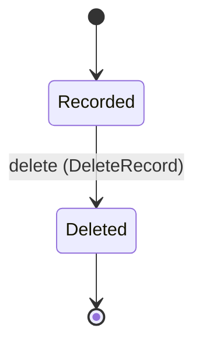

<!--
generated from softphone v1
model digest aba1da1149fb1642c433b23af295d777adcc159bd748b60ca1a5d9a812a4becf
contract digest f059b49bde0fd4d907197511f8dc422f77b181d48478bee6a29861987e9fd879
do not edit: regenerate with `ess generate`
-->

# Call history

One durable record per finished call, in the neutral termination vocabulary, optionally attributed to a contact. Deleted one record at a time; there is no bulk erase.

`softphone.history` is one of softphone's bounded contexts. [Back to the index](../index.md).

## Types

### `CallRecordId`

`softphone.history.CallRecordId` wraps `Uuid` and is not interchangeable with one: the whole value of naming it separately is the crossings the model then refuses.

### `CallRecordRow`

`softphone.history.CallRecordRow` is a record of 11 fields:

- `record_id` — `softphone.history.CallRecordId`
- `call_id` — `softphone.control.CallId`
- `contact_id` — `Optional<softphone.directory.ContactId>`, which may be absent
- `direction` — `softphone.control.CallDirection`
- `remote` — `softphone.control.RemoteAddress`
- `started_at` — `Timestamp`
- `ended_at` — `Timestamp`
- `answered_at` — `Optional<Timestamp>`, which may be absent
- `termination` — `softphone.control.EndCause`
- `status` — `Optional<softphone.control.RejectStatus>`, which may be absent
- `state` — `softphone.history.CallRecord.State`

One of the types above is reached by nothing else in this system: `softphone.history.CallRecordRow`. No entity, view, command, event, error or crossing names it, so it is either vocabulary something outside this specification uses or a leftover — and only a person can tell which.

## Entities

An entity is what this context is about: something with an identity that outlives any one request, a shape, and a lifecycle. The lifecycle is exhaustive — a move that is not drawn below is a move this specification does not permit, and that is the only way it says so. Every move is labelled with the command that takes it, because a move nothing can trigger is refused rather than drawn.

### `CallRecord`

`softphone.history.CallRecord`.

An instance is identified by `record_id`, a `softphone.history.CallRecordId`. The name is part of the model and not a convention: a view projects the identity under that name, so a projection inventing its own would disagree with the view.

It holds:

- `call_id` — `softphone.control.CallId`
- `contact_id` — `Optional<softphone.directory.ContactId>`, which may be absent
- `direction` — `softphone.control.CallDirection`
- `remote` — `softphone.control.RemoteAddress`
- `started_at` — `Timestamp`
- `ended_at` — `Timestamp`
- `answered_at` — `Optional<Timestamp>`, which may be absent
- `termination` — `softphone.control.EndCause`
- `status` — `Optional<softphone.control.RejectStatus>`, which may be absent

It references at most one [`softphone.control.Call`](softphone-control.md#call), as `call`, carried by `CallRecord.call_id`. It references at most one [`softphone.directory.Contact`](softphone-directory.md#contact), as `contact`, carried by `CallRecord.contact_id`.

Every instance satisfies `ended_at >= started_at` — a predicate over this entity's own fields, checked against them rather than stored as a sentence, so an invariant reading something the entity does not have is refused instead of documented.

Its state is a `softphone.history.CallRecord.State`, one of `Deleted` and `Recorded`. That enum is synthesised from the lifecycle rather than declared beside it, so the states a view's filter compares and the states drawn below cannot disagree.

An instance is created in `Recorded`. `Deleted` is terminal, so an instance may rest there forever. That is declared rather than inferred from having no way out: an entity that cannot leave a state is either finished or stuck, and only its author knows which.

Each move is taken by a declared command outcome, and a move nothing takes is refused as `missing_causation` rather than left as a state change nobody can trigger:

- `delete` — taken by `softphone.history.DeleteRecord` on its `deleted` outcome

An instance is brought into existence by `softphone.history.RecordCall` on its `recorded` outcome.

Illegal transitions are illegal by absence: no rule forbids them, there is simply no arrow, because a rule would be a second place for the same truth to live. A diagram cannot show an absence, so the pairs it does not connect are listed here, derived from the same transitions — anything named below is a move this specification does not permit.

- `Deleted` may not become `Recorded`

Two views project it: [`CallRecordById`](#callrecordbyid) and [`RecentCalls`](#recentcalls).

## Views

A view is what the outside world is promised it can observe. Each one says which instances it contains and how soon it reflects a command that has already returned, because "you can read this" without "how soon" is the promise every flaky suite is built on.

### `CallRecordById`

`softphone.history.CallRecordById`, shown to a person as "Call record by id" and called `call-record-by-id` on the wire.

It reads [`CallRecord`](#callrecord).

It contains the instances where `record_id == param.record_id` holds, and only those — so an instance a caller cannot find in here has been filtered out rather than lost.

It exposes:

- `record_id` — `softphone.history.CallRecordId`
- `call_id` — `softphone.control.CallId`
- `contact_id` — `Optional<softphone.directory.ContactId>`, which may be absent
- `direction` — `softphone.control.CallDirection`
- `remote` — `softphone.control.RemoteAddress`
- `started_at` — `Timestamp`
- `ended_at` — `Timestamp`
- `answered_at` — `Optional<Timestamp>`, which may be absent
- `termination` — `softphone.control.EndCause`
- `status` — `Optional<softphone.control.RejectStatus>`, which may be absent
- `state` — `softphone.history.CallRecord.State`

It declares no order, so the rows come back in whatever order the implementation has, and two reads may disagree.

**Read-your-writes**: it is current the moment the command that changed it returns. A caller that has just created an invoice and cannot see it in here has been told a lie about what it did.

A generated scenario asserts it once, immediately after the command: a view promising this and not keeping the promise has to fail the suite rather than be retried until it passes.

### `RecentCalls`

`softphone.history.RecentCalls`, shown to a person as "Recent calls" and called `recent-calls` on the wire.

It reads [`CallRecord`](#callrecord).

It contains the instances where `state == Recorded` holds, and only those — so an instance a caller cannot find in here has been filtered out rather than lost.

It exposes:

- `record_id` — `softphone.history.CallRecordId`
- `call_id` — `softphone.control.CallId`
- `contact_id` — `Optional<softphone.directory.ContactId>`, which may be absent
- `direction` — `softphone.control.CallDirection`
- `remote` — `softphone.control.RemoteAddress`
- `started_at` — `Timestamp`
- `ended_at` — `Timestamp`
- `answered_at` — `Optional<Timestamp>`, which may be absent
- `termination` — `softphone.control.EndCause`
- `status` — `Optional<softphone.control.RejectStatus>`, which may be absent
- `state` — `softphone.history.CallRecord.State`

Its rows are ordered by `ended_at` descending.

**Read-your-writes**: it is current the moment the command that changed it returns. A caller that has just created an invoice and cannot see it in here has been told a lie about what it did.

A generated scenario asserts it once, immediately after the command: a view promising this and not keeping the promise has to fail the suite rather than be retried until it passes.

## Commands

### `AttributeRecord`

`softphone.history.AttributeRecord`, shown to a person as "Attribute record" and called `attribute-record` on the wire.

It takes:

- `record_id` — `softphone.history.CallRecordId`
- `contact_id` — `Optional<softphone.directory.ContactId>`, which may be absent

It has one outcome.

**`attributed`** — An absent `contact_id` clears the attribution; `remote` is never changed. The default branch, taken when no other outcome's condition matched. It changes a `softphone.history.CallRecord` without moving it along its lifecycle. The instance is the one named by the input field `record_id`. It emits `softphone.history.RecordAttributed`. It sets `contact_id` from `input.contact_id`. A test reaches it by constructing an input that satisfies no other outcome's condition.

### `DeleteRecord`

`softphone.history.DeleteRecord`, shown to a person as "Delete record" and called `delete-record` on the wire.

It takes:

- `record_id` — `softphone.history.CallRecordId`

It has two outcomes.

**`deleted`** — The default branch, taken when no other outcome's condition matched. It moves a `softphone.history.CallRecord` from `Recorded` to `Deleted`, along the declared move `delete`. The instance is the one named by the input field `record_id`. It emits `softphone.history.RecordDeleted`. A test reaches it by constructing an input that satisfies no other outcome's condition.

**`wrong-state`** — Taken when the subject is resting in a state none of this command's moves start from — a `softphone.history.CallRecord` in `Deleted`, which is what is left of the lifecycle once this command's own moves are taken away. The document lists none of it. No entity in this specification changes. It reports `softphone.history.CallRecordStateConflict`, carrying `state`. It emits nothing. A test reaches it by driving an instance into one of those states and then issuing the command, because no input selects this branch.

### `RecordCall`

`softphone.history.RecordCall`, shown to a person as "Record call" and called `record-call` on the wire.

It takes:

- `call_id` — `softphone.control.CallId`

It has one outcome.

**`recorded`** — Written once the call is terminal. `contact_id` is absent here; attribution is a separate command, because who a number belongs to can change after the call. The default branch, taken when no other outcome's condition matched. It creates a `softphone.history.CallRecord`, which starts in `Recorded`. The new instance's identity is published as `record_id` on `softphone.history.CallRecorded`. It emits `softphone.history.CallRecorded`. It sets `call_id` from `input.call_id`. A test reaches it by constructing an input that satisfies no other outcome's condition.

## Events

### `CallRecorded`

`softphone.history.CallRecorded`.

It carries:

- `record_id` — `softphone.history.CallRecordId`
- `call_id` — `softphone.control.CallId`

Emitted by `softphone.history.RecordCall` on its `recorded` outcome.

Nothing in this system reacts to it.

### `RecordAttributed`

`softphone.history.RecordAttributed`.

It carries:

- `record_id` — `softphone.history.CallRecordId`
- `contact_id` — `Optional<softphone.directory.ContactId>`, which may be absent

Emitted by `softphone.history.AttributeRecord` on its `attributed` outcome.

Nothing in this system reacts to it.

### `RecordDeleted`

`softphone.history.RecordDeleted`.

It carries:

- `record_id` — `softphone.history.CallRecordId`

Emitted by `softphone.history.DeleteRecord` on its `deleted` outcome.

Nothing in this system reacts to it.

## Errors

### `CallRecordStateConflict`

The record is not in a state from which the requested change is allowed.

It carries:

- `state` — `softphone.history.CallRecord.State`

Reported by `softphone.history.DeleteRecord` on its `wrong-state` outcome.

## Actors

An actor is who may ask this context for something. Every grant below points at a command this specification declares — a grant is a resolved reference, so "may invoke" something nobody wrote is not a permission this model can express, and an authorisation that authorises nothing cannot ship quietly.

### `HistoryHost`

`softphone.history.HistoryHost`, shown to a person as "History host".

It may invoke [`RecordCall`](#recordcall).

### `Human`

`softphone.history.Human`, shown to a person as "Human".

It may invoke [`AttributeRecord`](#attributerecord) and [`DeleteRecord`](#deleterecord).

---

Generated from softphone v1 · model digest `aba1da1149fb1642c433b23af295d777adcc159bd748b60ca1a5d9a812a4becf` · contract digest `f059b49bde0fd4d907197511f8dc422f77b181d48478bee6a29861987e9fd879`. Do not edit this file; change the specification and regenerate it with `ess generate`.
