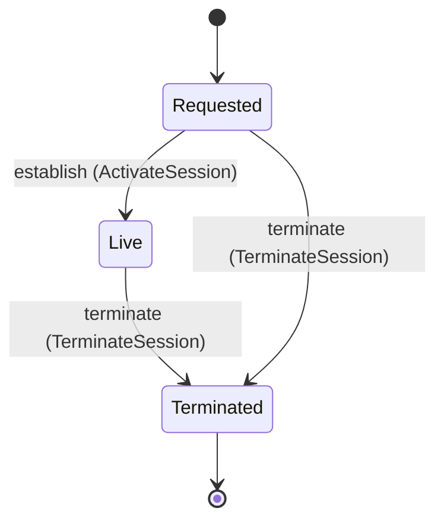

<!--
generated from softphone v1
model digest aba1da1149fb1642c433b23af295d777adcc159bd748b60ca1a5d9a812a4becf
contract digest af8016500b0f577bda6782c1b7f67c654aed2688f7e2b92f0f925252f2170d55
do not edit: regenerate with `ess generate`
-->

# Media session

One admitted media session, its neutral audio profile, the signals crossing it and the one reason it ended. Agnostic to SIP, RTVBP and WebRTC by construction: no relation and no field type here points at a binding domain.

`softphone.media` is one of softphone's bounded contexts. [Back to the index](../index.md).

## Types

### `BindingKind`

`softphone.media.BindingKind` is one of `Sip` and `Loopback`.

### `ChannelSignal`

`softphone.media.ChannelSignal` is one of one shape, told apart by a `kind` field — tagged, so a decoder never has to guess which branch it is reading:

- `dtmf` — `softphone.media.DigitString`

### `ContextTrust`

`softphone.media.ContextTrust` is one of `Untrusted`.

### `DigitString`

`softphone.media.DigitString` wraps `String` and is not interchangeable with one: the whole value of naming it separately is the crossings the model then refuses.

### `MediaProfile`

`softphone.media.MediaProfile` is a record of five fields:

- `sample_format` — `softphone.media.SampleFormat`
- `sample_rate_hz` — `Integer`
- `channels` — `Integer`
- `packet_time_ms` — `Integer`
- `frame_bytes` — `Integer`

Every value satisfies `sample_rate_hz == 8000`, `channels == 1`, `packet_time_ms == 20` and `frame_bytes == 320`.

### `MediaSessionId`

`softphone.media.MediaSessionId` wraps `Uuid` and is not interchangeable with one: the whole value of naming it separately is the crossings the model then refuses.

### `MediaSessionRow`

`softphone.media.MediaSessionRow` is a record of seven fields:

- `session_id` — `softphone.media.MediaSessionId`
- `session_ref` — `softphone.media.SessionRef`
- `binding` — `softphone.media.BindingKind`
- `profile` — `softphone.media.MediaProfile`
- `participant` — `softphone.media.Participant`
- `termination` — `Optional<softphone.media.TerminationReason>`, which may be absent
- `state` — `softphone.media.MediaSession.State`

### `Participant`

`softphone.media.Participant` is a record of three fields:

- `reference` — `softphone.media.SessionRef`
- `trust` — `softphone.media.ContextTrust`
- `display` — `Optional<String>`, which may be absent

### `SampleFormat`

`softphone.media.SampleFormat` is one of `PcmS16Le`.

### `SessionRef`

`softphone.media.SessionRef` wraps `String` and is not interchangeable with one: the whole value of naming it separately is the crossings the model then refuses.

### `TerminationReason`

`softphone.media.TerminationReason` is one of `Completed`, `Cancelled`, `RemoteHangup`, `AuthorityRevoked`, `LeaseExpired`, `MediaOverload`, `TransportLost` and `ProtocolError`.

One of the types above is reached by nothing else in this system: `softphone.media.MediaSessionRow`. No entity, view, command, event, error or crossing names it, so it is either vocabulary something outside this specification uses or a leftover — and only a person can tell which.

## Entities

An entity is what this context is about: something with an identity that outlives any one request, a shape, and a lifecycle. The lifecycle is exhaustive — a move that is not drawn below is a move this specification does not permit, and that is the only way it says so. Every move is labelled with the command that takes it, because a move nothing can trigger is refused rather than drawn.

### `MediaSession`

`softphone.media.MediaSession`.

An instance is identified by `session_id`, a `softphone.media.MediaSessionId`. The name is part of the model and not a convention: a view projects the identity under that name, so a projection inventing its own would disagree with the view.

It holds:

- `session_ref` — `softphone.media.SessionRef`
- `binding` — `softphone.media.BindingKind`
- `profile` — `softphone.media.MediaProfile`
- `participant` — `softphone.media.Participant`
- `termination` — `Optional<softphone.media.TerminationReason>`, which may be absent

It declares no relation to another entity, and no other entity names it.

Every instance satisfies `(not (state == Terminated) or defined(termination))` — a predicate over this entity's own fields, checked against them rather than stored as a sentence, so an invariant reading something the entity does not have is refused instead of documented.

Its state is a `softphone.media.MediaSession.State`, one of `Live`, `Requested` and `Terminated`. That enum is synthesised from the lifecycle rather than declared beside it, so the states a view's filter compares and the states drawn below cannot disagree.

An instance is created in `Requested`. `Terminated` is terminal, so an instance may rest there forever. That is declared rather than inferred from having no way out: an entity that cannot leave a state is either finished or stuck, and only its author knows which.

Each move is taken by a declared command outcome, and a move nothing takes is refused as `missing_causation` rather than left as a state change nobody can trigger:

- `establish` — taken by `softphone.media.ActivateSession` on its `activated` outcome
- `terminate` — taken by `softphone.media.TerminateSession` on its `terminated` outcome

An instance is brought into existence by `softphone.media.OpenSession` on its `opened` outcome.

Illegal transitions are illegal by absence: no rule forbids them, there is simply no arrow, because a rule would be a second place for the same truth to live. A diagram cannot show an absence, so the pairs it does not connect are listed here, derived from the same transitions — anything named below is a move this specification does not permit.

- `Live` may not become `Requested`
- `Terminated` may not become `Live`
- `Terminated` may not become `Requested`

Two views project it: [`LiveSessions`](#livesessions) and [`MediaSessionById`](#mediasessionbyid).

## Views

A view is what the outside world is promised it can observe. Each one says which instances it contains and how soon it reflects a command that has already returned, because "you can read this" without "how soon" is the promise every flaky suite is built on.

### `LiveSessions`

`softphone.media.LiveSessions`, shown to a person as "Live sessions" and called `live-sessions` on the wire.

It reads [`MediaSession`](#mediasession).

It contains the instances where `state == Live` holds, and only those — so an instance a caller cannot find in here has been filtered out rather than lost.

It exposes:

- `session_id` — `softphone.media.MediaSessionId`
- `session_ref` — `softphone.media.SessionRef`
- `binding` — `softphone.media.BindingKind`
- `profile` — `softphone.media.MediaProfile`
- `participant` — `softphone.media.Participant`
- `termination` — `Optional<softphone.media.TerminationReason>`, which may be absent
- `state` — `softphone.media.MediaSession.State`

It declares no order, so the rows come back in whatever order the implementation has, and two reads may disagree.

**Read-your-writes**: it is current the moment the command that changed it returns. A caller that has just created an invoice and cannot see it in here has been told a lie about what it did.

A generated scenario asserts it once, immediately after the command: a view promising this and not keeping the promise has to fail the suite rather than be retried until it passes.

### `MediaSessionById`

`softphone.media.MediaSessionById`, shown to a person as "Media session by id" and called `media-session-by-id` on the wire.

It reads [`MediaSession`](#mediasession).

It contains the instances where `session_id == param.session_id` holds, and only those — so an instance a caller cannot find in here has been filtered out rather than lost.

It exposes:

- `session_id` — `softphone.media.MediaSessionId`
- `session_ref` — `softphone.media.SessionRef`
- `binding` — `softphone.media.BindingKind`
- `profile` — `softphone.media.MediaProfile`
- `participant` — `softphone.media.Participant`
- `termination` — `Optional<softphone.media.TerminationReason>`, which may be absent
- `state` — `softphone.media.MediaSession.State`

It declares no order, so the rows come back in whatever order the implementation has, and two reads may disagree.

**Read-your-writes**: it is current the moment the command that changed it returns. A caller that has just created an invoice and cannot see it in here has been told a lie about what it did.

A generated scenario asserts it once, immediately after the command: a view promising this and not keeping the promise has to fail the suite rather than be retried until it passes.

## Commands

### `ActivateSession`

`softphone.media.ActivateSession`, shown to a person as "Activate session" and called `activate-session` on the wire.

It takes:

- `session_id` — `softphone.media.MediaSessionId`

It has two outcomes.

**`activated`** — The default branch, taken when no other outcome's condition matched. It moves a `softphone.media.MediaSession` from `Requested` to `Live`, along the declared move `establish`. The instance is the one named by the input field `session_id`. It emits `softphone.media.SessionActivated`. A test reaches it by constructing an input that satisfies no other outcome's condition.

**`wrong-state`** — Taken when the subject is resting in a state none of this command's moves start from — a `softphone.media.MediaSession` in `Live` and `Terminated`, which is what is left of the lifecycle once this command's own moves are taken away. The document lists none of it. No entity in this specification changes. It reports `softphone.media.MediaSessionStateConflict`, carrying `state`. It emits nothing. A test reaches it by driving an instance into one of those states and then issuing the command, because no input selects this branch.

### `InterruptOutput`

`softphone.media.InterruptOutput`, shown to a person as "Interrupt output" and called `interrupt-output` on the wire.

Recorded at `connectors:crates/domain/src/voice.rs#L192`.

It takes:

- `session_id` — `softphone.media.MediaSessionId`

It has one outcome.

**`interrupted`** — The default branch, taken when no other outcome's condition matched. No entity in this specification changes. It emits `softphone.media.OutputInterrupted`. A test reaches it by constructing an input that satisfies no other outcome's condition.

### `OpenSession`

`softphone.media.OpenSession`, shown to a person as "Open session" and called `open-session` on the wire.

Recorded at `connectors:crates/domain/src/voice.rs#L152`.

It takes:

- `session_ref` — `softphone.media.SessionRef`
- `binding` — `softphone.media.BindingKind`
- `profile` — `softphone.media.MediaProfile`
- `participant` — `softphone.media.Participant`

It has one outcome.

**`opened`** — The session is Requested; no media crosses it until it is Live. The default branch, taken when no other outcome's condition matched. It creates a `softphone.media.MediaSession`, which starts in `Requested`. The new instance's identity is published as `session_id` on `softphone.media.SessionOpened`. It emits `softphone.media.SessionOpened`. It sets `session_ref` from `input.session_ref`, `binding` from `input.binding`, `profile` from `input.profile` and `participant` from `input.participant`. A test reaches it by constructing an input that satisfies no other outcome's condition.

### `ReceiveSignal`

`softphone.media.ReceiveSignal`, shown to a person as "Receive signal" and called `receive-signal` on the wire.

Recorded at `connectors:crates/domain/src/voice.rs#L167`.

It takes:

- `session_id` — `softphone.media.MediaSessionId`
- `signal` — `softphone.media.ChannelSignal`

It has one outcome.

**`received`** — The default branch, taken when no other outcome's condition matched. No entity in this specification changes. It emits `softphone.media.SignalReceived`. A test reaches it by constructing an input that satisfies no other outcome's condition.

### `SendSignal`

`softphone.media.SendSignal`, shown to a person as "Send signal" and called `send-signal` on the wire.

Recorded at `connectors:crates/domain/src/voice.rs#L174`.

It takes:

- `session_id` — `softphone.media.MediaSessionId`
- `signal` — `softphone.media.ChannelSignal`

It has one outcome.

**`sent`** — The default branch, taken when no other outcome's condition matched. No entity in this specification changes. It emits `softphone.media.SignalSent`. A test reaches it by constructing an input that satisfies no other outcome's condition.

### `TerminateSession`

`softphone.media.TerminateSession`, shown to a person as "Terminate session" and called `terminate-session` on the wire.

Recorded at `connectors:crates/domain/src/voice.rs#L193`.

It takes:

- `session_id` — `softphone.media.MediaSessionId`
- `reason` — `softphone.media.TerminationReason`

It has two outcomes.

**`terminated`** — The default branch, taken when no other outcome's condition matched. It moves a `softphone.media.MediaSession` from `Live` and `Requested` to `Terminated`, along the declared move `terminate`. The instance is the one named by the input field `session_id`. It emits `softphone.media.SessionTerminated`. It sets `termination` from `input.reason`. A test reaches it by constructing an input that satisfies no other outcome's condition.

**`wrong-state`** — Taken when the subject is resting in a state none of this command's moves start from — a `softphone.media.MediaSession` in `Terminated`, which is what is left of the lifecycle once this command's own moves are taken away. The document lists none of it. No entity in this specification changes. It reports `softphone.media.MediaSessionStateConflict`, carrying `state`. It emits nothing. A test reaches it by driving an instance into one of those states and then issuing the command, because no input selects this branch.

## Events

### `OutputInterrupted`

`softphone.media.OutputInterrupted`.

It carries:

- `session_id` — `softphone.media.MediaSessionId`

Emitted by `softphone.media.InterruptOutput` on its `interrupted` outcome.

Nothing in this system reacts to it.

### `SessionActivated`

`softphone.media.SessionActivated`.

It carries:

- `session_id` — `softphone.media.MediaSessionId`

Emitted by `softphone.media.ActivateSession` on its `activated` outcome.

Nothing in this system reacts to it.

### `SessionOpened`

`softphone.media.SessionOpened`.

It carries:

- `session_id` — `softphone.media.MediaSessionId`
- `session_ref` — `softphone.media.SessionRef`
- `binding` — `softphone.media.BindingKind`
- `profile` — `softphone.media.MediaProfile`
- `participant` — `softphone.media.Participant`

Emitted by `softphone.media.OpenSession` on its `opened` outcome.

Nothing in this system reacts to it.

### `SessionTerminated`

`softphone.media.SessionTerminated`.

It carries:

- `session_id` — `softphone.media.MediaSessionId`
- `reason` — `softphone.media.TerminationReason`

Emitted by `softphone.media.TerminateSession` on its `terminated` outcome.

Nothing in this system reacts to it.

### `SignalReceived`

`softphone.media.SignalReceived`.

It carries:

- `session_id` — `softphone.media.MediaSessionId`
- `signal` — `softphone.media.ChannelSignal`

Emitted by `softphone.media.ReceiveSignal` on its `received` outcome.

Nothing in this system reacts to it.

### `SignalSent`

`softphone.media.SignalSent`.

It carries:

- `session_id` — `softphone.media.MediaSessionId`
- `signal` — `softphone.media.ChannelSignal`

Emitted by `softphone.media.SendSignal` on its `sent` outcome.

Nothing in this system reacts to it.

## Errors

### `MediaSessionStateConflict`

The session is not in a state from which the requested change is allowed.

It carries:

- `state` — `softphone.media.MediaSession.State`

Reported by `softphone.media.ActivateSession` on its `wrong-state` outcome.

Reported by `softphone.media.TerminateSession` on its `wrong-state` outcome.

## Actors

An actor is who may ask this context for something. Every grant below points at a command this specification declares — a grant is a resolved reference, so "may invoke" something nobody wrote is not a permission this model can express, and an authorisation that authorises nothing cannot ship quietly.

### `SessionHost`

`softphone.media.SessionHost`, shown to a person as "Session host".

It may invoke [`ActivateSession`](#activatesession), [`InterruptOutput`](#interruptoutput), [`OpenSession`](#opensession), [`ReceiveSignal`](#receivesignal), [`SendSignal`](#sendsignal) and [`TerminateSession`](#terminatesession).

---

Generated from softphone v1 · model digest `aba1da1149fb1642c433b23af295d777adcc159bd748b60ca1a5d9a812a4becf` · contract digest `af8016500b0f577bda6782c1b7f67c654aed2688f7e2b92f0f925252f2170d55`. Do not edit this file; change the specification and regenerate it with `ess generate`.
