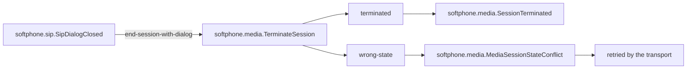
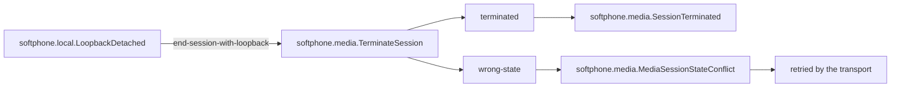
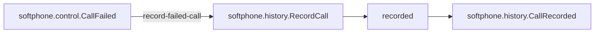
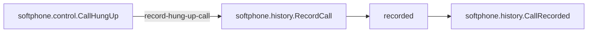
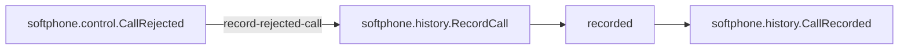
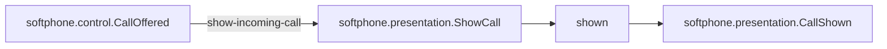
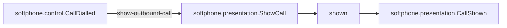

<!--
generated from softphone v1
model digest aba1da1149fb1642c433b23af295d777adcc159bd748b60ca1a5d9a812a4becf
contract digest ef93fa7f8584a1ef672990779da742c4036cf471dd4a5ce03ec96443be9da643
do not edit: regenerate with `ess generate`
-->

# Interactions

A binding is the only way an event in one context causes a command in another. Each one states how many times the command may run and what happens when it does not, because a binding that can fail quietly is the difference between specifying a system and specifying a demo.

[Back to the index](index.md).

## `end-session-with-dialog`

Closing the dialog terminates the session it carried.

`softphone.sip.SipDialogClosed` causes [`softphone.media.TerminateSession`](domains/softphone-media.md#terminatesession).

Delivered **at least once**, so `softphone.media.TerminateSession` must be idempotent: the same event arriving twice must not do the work twice. "Exactly once" is what everyone believes they have until a retry proves otherwise, which is why this is written down rather than assumed.

When it fails it is **retried**, on whatever schedule the transport provides. Nothing here says how many times, so nothing here says when it stops. A retry publishes nothing of its own, because it is already observable: it is another invocation of the command.

It fills the command's input like this:

- `session_id` (`softphone.media.MediaSessionId`) ← the event's `session_id` (`softphone.media.MediaSessionId`).
- `reason` (`softphone.media.TerminationReason`) ← the event's `reason` (`softphone.media.TerminationReason`).

## `end-session-with-loopback`

Detaching the loopback terminates the session it carried.

`softphone.local.LoopbackDetached` causes [`softphone.media.TerminateSession`](domains/softphone-media.md#terminatesession).

Delivered **at least once**, so `softphone.media.TerminateSession` must be idempotent: the same event arriving twice must not do the work twice. "Exactly once" is what everyone believes they have until a retry proves otherwise, which is why this is written down rather than assumed.

When it fails it is **retried**, on whatever schedule the transport provides. Nothing here says how many times, so nothing here says when it stops. A retry publishes nothing of its own, because it is already observable: it is another invocation of the command.

It fills the command's input like this:

- `session_id` (`softphone.media.MediaSessionId`) ← the event's `session_id` (`softphone.media.MediaSessionId`).
- `reason` (`softphone.media.TerminationReason`) ← the event's `reason` (`softphone.media.TerminationReason`).

## `record-failed-call`

A call the network ended reaches the log.

`softphone.control.CallFailed` causes [`softphone.history.RecordCall`](domains/softphone-history.md#recordcall).

Delivered **at least once**, so `softphone.history.RecordCall` must be idempotent: the same event arriving twice must not do the work twice. "Exactly once" is what everyone believes they have until a retry proves otherwise, which is why this is written down rather than assumed.

When it fails it is **retried**, on whatever schedule the transport provides. Nothing here says how many times, so nothing here says when it stops. A retry publishes nothing of its own, because it is already observable: it is another invocation of the command.

It fills the command's input like this:

- `call_id` (`softphone.control.CallId`) ← the event's `call_id` (`softphone.control.CallId`).

## `record-hung-up-call`

A call the user ended reaches the log.

`softphone.control.CallHungUp` causes [`softphone.history.RecordCall`](domains/softphone-history.md#recordcall).

Delivered **at least once**, so `softphone.history.RecordCall` must be idempotent: the same event arriving twice must not do the work twice. "Exactly once" is what everyone believes they have until a retry proves otherwise, which is why this is written down rather than assumed.

When it fails it is **retried**, on whatever schedule the transport provides. Nothing here says how many times, so nothing here says when it stops. A retry publishes nothing of its own, because it is already observable: it is another invocation of the command.

It fills the command's input like this:

- `call_id` (`softphone.control.CallId`) ← the event's `call_id` (`softphone.control.CallId`).

## `record-rejected-call`

A call the user declined reaches the log.

`softphone.control.CallRejected` causes [`softphone.history.RecordCall`](domains/softphone-history.md#recordcall).

Delivered **at least once**, so `softphone.history.RecordCall` must be idempotent: the same event arriving twice must not do the work twice. "Exactly once" is what everyone believes they have until a retry proves otherwise, which is why this is written down rather than assumed.

When it fails it is **retried**, on whatever schedule the transport provides. Nothing here says how many times, so nothing here says when it stops. A retry publishes nothing of its own, because it is already observable: it is another invocation of the command.

It fills the command's input like this:

- `call_id` (`softphone.control.CallId`) ← the event's `call_id` (`softphone.control.CallId`).

## `show-incoming-call`

An arriving call puts itself on screen.

`softphone.control.CallOffered` causes [`softphone.presentation.ShowCall`](domains/softphone-presentation.md#showcall).

Delivered **at least once**, so `softphone.presentation.ShowCall` must be idempotent: the same event arriving twice must not do the work twice. "Exactly once" is what everyone believes they have until a retry proves otherwise, which is why this is written down rather than assumed.

When it fails it is **retried**, on whatever schedule the transport provides. Nothing here says how many times, so nothing here says when it stops. A retry publishes nothing of its own, because it is already observable: it is another invocation of the command.

It fills the command's input like this:

- `call_id` (`softphone.control.CallId`) ← the event's `call_id` (`softphone.control.CallId`).

## `show-outbound-call`

A call being placed puts itself on screen.

`softphone.control.CallDialled` causes [`softphone.presentation.ShowCall`](domains/softphone-presentation.md#showcall).

Delivered **at least once**, so `softphone.presentation.ShowCall` must be idempotent: the same event arriving twice must not do the work twice. "Exactly once" is what everyone believes they have until a retry proves otherwise, which is why this is written down rather than assumed.

When it fails it is **retried**, on whatever schedule the transport provides. Nothing here says how many times, so nothing here says when it stops. A retry publishes nothing of its own, because it is already observable: it is another invocation of the command.

It fills the command's input like this:

- `call_id` (`softphone.control.CallId`) ← the event's `call_id` (`softphone.control.CallId`).

## Events nothing reacts to

Legal, and worth seeing. An event with no reader inside the system is either a deliberate boundary — something outside consumes it — or a binding somebody forgot, and only a person can tell which.

- `softphone.control.CallAnswered`
- `softphone.control.CallConfirmed`
- `softphone.control.CallEstablished`
- `softphone.control.CallRinging`
- `softphone.control.DigitsSent`
- `softphone.control.EndpointConfigured`
- `softphone.control.MediaAttached`
- `softphone.control.MuteChanged`
- `softphone.directory.ContactAdded`
- `softphone.directory.ContactAddressAdded`
- `softphone.directory.ContactAddressRemoved`
- `softphone.directory.ContactDeleted`
- `softphone.directory.ContactRenamed`
- `softphone.history.CallRecorded`
- `softphone.history.RecordAttributed`
- `softphone.history.RecordDeleted`
- `softphone.local.LoopbackAttached`
- `softphone.media.OutputInterrupted`
- `softphone.media.SessionActivated`
- `softphone.media.SessionOpened`
- `softphone.media.SessionTerminated`
- `softphone.media.SignalReceived`
- `softphone.media.SignalSent`
- `softphone.presentation.CallDismissed`
- `softphone.presentation.CallShown`
- `softphone.presentation.ConsoleDialing`
- `softphone.presentation.ConsoleEngaged`
- `softphone.presentation.ConsoleIncoming`
- `softphone.presentation.ConsoleOpened`
- `softphone.presentation.ConsoleReleased`
- `softphone.presentation.EntryCleared`
- `softphone.presentation.KeyPressed`
- `softphone.presentation.KeypadOpened`
- `softphone.presentation.TileAttributed`
- `softphone.sip.LocalMediaFailed`
- `softphone.sip.LocalMediaOffered`
- `softphone.sip.LocalMediaRequested`
- `softphone.sip.RegistrationConfirmed`
- `softphone.sip.RegistrationEnded`
- `softphone.sip.RegistrationFailed`
- `softphone.sip.RegistrationRefreshed`
- `softphone.sip.RegistrationRequested`
- `softphone.sip.RegistrationRetried`
- `softphone.sip.RemoteMediaApplied`
- `softphone.sip.SipDialogOpened`

---

Generated from softphone v1 · model digest `aba1da1149fb1642c433b23af295d777adcc159bd748b60ca1a5d9a812a4becf` · contract digest `ef93fa7f8584a1ef672990779da742c4036cf471dd4a5ce03ec96443be9da643`. Do not edit this file; change the specification and regenerate it with `ess generate`.
