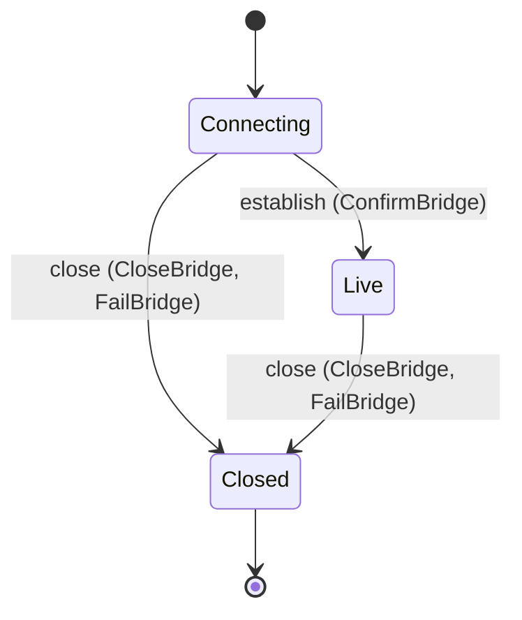

<!--
generated from softphone v1
model digest 3d66648c3a80c2b5ba8ed8e6e8d9bfcbe91e4312afd50f56a5fea9297e7297a6
contract digest 322b091c4af910d4501985517e55f15d349162196735c979779f5ed2fd5c153a
do not edit: regenerate with `ess generate`
-->

# Media bridge

One media bridge from this phone to the server that holds its SIP leg: where it points, the offer it sent, the answer it got and why it closed. No SIP construct appears here.

`softphone.bridge` is one of softphone's bounded contexts. [Back to the index](../index.md).

## Types

### `BridgeCause`

`softphone.bridge.BridgeCause` is one of `Local`, `Remote`, `Transport` and `Refused`.

### `BridgeId`

`softphone.bridge.BridgeId` wraps `Uuid` and is not interchangeable with one: the whole value of naming it separately is the crossings the model then refuses.

### `BridgeSessionRow`

`softphone.bridge.BridgeSessionRow` is a record of seven fields:

- `bridge_id` — `softphone.bridge.BridgeId`
- `session_id` — `softphone.media.MediaSessionId`
- `endpoint` — `softphone.bridge.ServerEndpoint`
- `local_sdp` — `softphone.bridge.SessionDescription`
- `remote_sdp` — `Optional<softphone.bridge.SessionDescription>`, which may be absent
- `cause` — `Optional<softphone.bridge.BridgeCause>`, which may be absent
- `state` — `softphone.bridge.BridgeSession.State`

### `ServerEndpoint`

`softphone.bridge.ServerEndpoint` wraps `String` and is not interchangeable with one: the whole value of naming it separately is the crossings the model then refuses.

### `SessionDescription`

`softphone.bridge.SessionDescription` wraps `String` and is not interchangeable with one: the whole value of naming it separately is the crossings the model then refuses.

One of the types above is reached by nothing else in this system: `softphone.bridge.BridgeSessionRow`. No entity, view, command, event, error or crossing names it, so it is either vocabulary something outside this specification uses or a leftover — and only a person can tell which.

## Entities

An entity is what this context is about: something with an identity that outlives any one request, a shape, and a lifecycle. The lifecycle is exhaustive — a move that is not drawn below is a move this specification does not permit, and that is the only way it says so. Every move is labelled with the command that takes it, because a move nothing can trigger is refused rather than drawn.

### `BridgeSession`

`softphone.bridge.BridgeSession`.

An instance is identified by `bridge_id`, a `softphone.bridge.BridgeId`. The name is part of the model and not a convention: a view projects the identity under that name, so a projection inventing its own would disagree with the view.

It holds:

- `session_id` — `softphone.media.MediaSessionId`
- `endpoint` — `softphone.bridge.ServerEndpoint`
- `local_sdp` — `softphone.bridge.SessionDescription`
- `remote_sdp` — `Optional<softphone.bridge.SessionDescription>`, which may be absent
- `cause` — `Optional<softphone.bridge.BridgeCause>`, which may be absent

It references at most one [`softphone.media.MediaSession`](softphone-media.md#mediasession), as `session`, carried by `BridgeSession.session_id`.

Every instance satisfies `(not (state == Live) or defined(remote_sdp))` and `(not (state == Closed) or defined(cause))` — a predicate over this entity's own fields, checked against them rather than stored as a sentence, so an invariant reading something the entity does not have is refused instead of documented.

Its state is a `softphone.bridge.BridgeSession.State`, one of `Closed`, `Connecting` and `Live`. That enum is synthesised from the lifecycle rather than declared beside it, so the states a view's filter compares and the states drawn below cannot disagree.

An instance is created in `Connecting`. `Closed` is terminal, so an instance may rest there forever. That is declared rather than inferred from having no way out: an entity that cannot leave a state is either finished or stuck, and only its author knows which.

Each move is taken by a declared command outcome, and a move nothing takes is refused as `missing_causation` rather than left as a state change nobody can trigger:

- `establish` — taken by `softphone.bridge.ConfirmBridge` on its `confirmed` outcome
- `close` — taken by `softphone.bridge.CloseBridge` on its `closed` outcome and `softphone.bridge.FailBridge` on its `failed` outcome

An instance is brought into existence by `softphone.bridge.ConnectBridge` on its `connecting` outcome.

Illegal transitions are illegal by absence: no rule forbids them, there is simply no arrow, because a rule would be a second place for the same truth to live. A diagram cannot show an absence, so the pairs it does not connect are listed here, derived from the same transitions — anything named below is a move this specification does not permit.

- `Closed` may not become `Connecting`
- `Closed` may not become `Live`
- `Live` may not become `Connecting`

Two views project it: [`BridgeById`](#bridgebyid) and [`LiveBridges`](#livebridges).

## Views

A view is what the outside world is promised it can observe. Each one says which instances it contains and how soon it reflects a command that has already returned, because "you can read this" without "how soon" is the promise every flaky suite is built on.

### `BridgeById`

`softphone.bridge.BridgeById`, shown to a person as "Bridge by id" and called `bridge-by-id` on the wire.

It reads [`BridgeSession`](#bridgesession).

It contains the instances where `bridge_id == param.bridge_id` holds, and only those — so an instance a caller cannot find in here has been filtered out rather than lost.

It exposes:

- `bridge_id` — `softphone.bridge.BridgeId`
- `session_id` — `softphone.media.MediaSessionId`
- `endpoint` — `softphone.bridge.ServerEndpoint`
- `local_sdp` — `softphone.bridge.SessionDescription`
- `remote_sdp` — `Optional<softphone.bridge.SessionDescription>`, which may be absent
- `cause` — `Optional<softphone.bridge.BridgeCause>`, which may be absent
- `state` — `softphone.bridge.BridgeSession.State`

It declares no order, so the rows come back in whatever order the implementation has, and two reads may disagree.

**Read-your-writes**: it is current the moment the command that changed it returns. A caller that has just created an invoice and cannot see it in here has been told a lie about what it did.

A generated scenario asserts it once, immediately after the command: a view promising this and not keeping the promise has to fail the suite rather than be retried until it passes.

### `LiveBridges`

`softphone.bridge.LiveBridges`, shown to a person as "Live bridges" and called `live-bridges` on the wire.

It reads [`BridgeSession`](#bridgesession).

It contains the instances where `state == Live` holds, and only those — so an instance a caller cannot find in here has been filtered out rather than lost.

It exposes:

- `bridge_id` — `softphone.bridge.BridgeId`
- `session_id` — `softphone.media.MediaSessionId`
- `endpoint` — `softphone.bridge.ServerEndpoint`
- `local_sdp` — `softphone.bridge.SessionDescription`
- `remote_sdp` — `Optional<softphone.bridge.SessionDescription>`, which may be absent
- `cause` — `Optional<softphone.bridge.BridgeCause>`, which may be absent
- `state` — `softphone.bridge.BridgeSession.State`

It declares no order, so the rows come back in whatever order the implementation has, and two reads may disagree.

**Read-your-writes**: it is current the moment the command that changed it returns. A caller that has just created an invoice and cannot see it in here has been told a lie about what it did.

A generated scenario asserts it once, immediately after the command: a view promising this and not keeping the promise has to fail the suite rather than be retried until it passes.

## Commands

### `CloseBridge`

`softphone.bridge.CloseBridge`, shown to a person as "Close bridge" and called `close-bridge` on the wire.

It takes:

- `bridge_id` — `softphone.bridge.BridgeId`
- `session_id` — `softphone.media.MediaSessionId`
- `cause` — `softphone.bridge.BridgeCause`
- `reason` — `softphone.media.TerminationReason`

It has two outcomes.

**`closed`** — The default branch, taken when no other outcome's condition matched. It moves a `softphone.bridge.BridgeSession` from `Connecting` and `Live` to `Closed`, along the declared move `close`. The instance is the one named by the input field `bridge_id`. It emits `softphone.bridge.BridgeClosed`. It sets `cause` from `input.cause`. A test reaches it by constructing an input that satisfies no other outcome's condition.

**`wrong-state`** — Taken when the subject is resting in a state none of this command's moves start from — a `softphone.bridge.BridgeSession` in `Closed`, which is what is left of the lifecycle once this command's own moves are taken away. The document lists none of it. No entity in this specification changes. It reports `softphone.bridge.BridgeStateConflict`, carrying `state`. It emits nothing. A test reaches it by driving an instance into one of those states and then issuing the command, because no input selects this branch.

### `ConfirmBridge`

`softphone.bridge.ConfirmBridge`, shown to a person as "Confirm bridge" and called `confirm-bridge` on the wire.

It takes:

- `bridge_id` — `softphone.bridge.BridgeId`
- `session_id` — `softphone.media.MediaSessionId`
- `answer` — `softphone.bridge.SessionDescription`

It has two outcomes.

**`confirmed`** — The default branch, taken when no other outcome's condition matched. It moves a `softphone.bridge.BridgeSession` from `Connecting` to `Live`, along the declared move `establish`. The instance is the one named by the input field `bridge_id`. It emits `softphone.bridge.BridgeConfirmed`. It sets `remote_sdp` from `input.answer`. A test reaches it by constructing an input that satisfies no other outcome's condition.

**`wrong-state`** — Taken when the subject is resting in a state none of this command's moves start from — a `softphone.bridge.BridgeSession` in `Closed` and `Live`, which is what is left of the lifecycle once this command's own moves are taken away. The document lists none of it. No entity in this specification changes. It reports `softphone.bridge.BridgeStateConflict`, carrying `state`. It emits nothing. A test reaches it by driving an instance into one of those states and then issuing the command, because no input selects this branch.

### `ConnectBridge`

`softphone.bridge.ConnectBridge`, shown to a person as "Connect bridge" and called `connect-bridge` on the wire.

It takes:

- `session_id` — `softphone.media.MediaSessionId`
- `endpoint` — `softphone.bridge.ServerEndpoint`
- `offer` — `softphone.bridge.SessionDescription`

It has one outcome.

**`connecting`** — The only outcome that creates a `BridgeSession`, which is what keeps the `Bridge` discriminator on `softphone.media.MediaSession` honest. The default branch, taken when no other outcome's condition matched. It creates a `softphone.bridge.BridgeSession`, which starts in `Connecting`. The new instance's identity is published as `bridge_id` on `softphone.bridge.BridgeConnecting`. It emits `softphone.bridge.BridgeConnecting`. It sets `session_id` from `input.session_id`, `endpoint` from `input.endpoint` and `local_sdp` from `input.offer`. A test reaches it by constructing an input that satisfies no other outcome's condition.

### `FailBridge`

`softphone.bridge.FailBridge`, shown to a person as "Fail bridge" and called `fail-bridge` on the wire.

It takes:

- `bridge_id` — `softphone.bridge.BridgeId`
- `session_id` — `softphone.media.MediaSessionId`
- `cause` — `softphone.bridge.BridgeCause`
- `reason` — `softphone.media.TerminationReason`

It has two outcomes.

**`failed`** — A bridge that never came up and one that died mid-call are the same move with a different `cause`; the neutral reason is what the media layer is told. The default branch, taken when no other outcome's condition matched. It moves a `softphone.bridge.BridgeSession` from `Connecting` and `Live` to `Closed`, along the declared move `close`. The instance is the one named by the input field `bridge_id`. It emits `softphone.bridge.BridgeFailed`. It sets `cause` from `input.cause`. A test reaches it by constructing an input that satisfies no other outcome's condition.

**`wrong-state`** — Taken when the subject is resting in a state none of this command's moves start from — a `softphone.bridge.BridgeSession` in `Closed`, which is what is left of the lifecycle once this command's own moves are taken away. The document lists none of it. No entity in this specification changes. It reports `softphone.bridge.BridgeStateConflict`, carrying `state`. It emits nothing. A test reaches it by driving an instance into one of those states and then issuing the command, because no input selects this branch.

## Events

### `BridgeClosed`

`softphone.bridge.BridgeClosed`.

It carries:

- `bridge_id` — `softphone.bridge.BridgeId`
- `session_id` — `softphone.media.MediaSessionId`
- `cause` — `softphone.bridge.BridgeCause`
- `reason` — `softphone.media.TerminationReason`

Emitted by `softphone.bridge.CloseBridge` on its `closed` outcome.

`end-session-with-bridge` reacts to it — see [Interactions](../interactions.md).

### `BridgeConfirmed`

`softphone.bridge.BridgeConfirmed`.

It carries:

- `bridge_id` — `softphone.bridge.BridgeId`
- `session_id` — `softphone.media.MediaSessionId`
- `answer` — `softphone.bridge.SessionDescription`

Emitted by `softphone.bridge.ConfirmBridge` on its `confirmed` outcome.

`activate-session-with-bridge` reacts to it — see [Interactions](../interactions.md).

### `BridgeConnecting`

`softphone.bridge.BridgeConnecting`.

It carries:

- `bridge_id` — `softphone.bridge.BridgeId`
- `session_id` — `softphone.media.MediaSessionId`
- `endpoint` — `softphone.bridge.ServerEndpoint`
- `offer` — `softphone.bridge.SessionDescription`

Emitted by `softphone.bridge.ConnectBridge` on its `connecting` outcome.

Nothing in this system reacts to it.

### `BridgeFailed`

`softphone.bridge.BridgeFailed`.

It carries:

- `bridge_id` — `softphone.bridge.BridgeId`
- `session_id` — `softphone.media.MediaSessionId`
- `cause` — `softphone.bridge.BridgeCause`
- `reason` — `softphone.media.TerminationReason`

Emitted by `softphone.bridge.FailBridge` on its `failed` outcome.

`end-session-with-failed-bridge` reacts to it — see [Interactions](../interactions.md).

## Errors

### `BridgeStateConflict`

The bridge is not in a state from which the requested change is allowed.

It carries:

- `state` — `softphone.bridge.BridgeSession.State`

Reported by `softphone.bridge.CloseBridge` on its `wrong-state` outcome.

Reported by `softphone.bridge.ConfirmBridge` on its `wrong-state` outcome.

Reported by `softphone.bridge.FailBridge` on its `wrong-state` outcome.

## Actors

An actor is who may ask this context for something. Every grant below points at a command this specification declares — a grant is a resolved reference, so "may invoke" something nobody wrote is not a permission this model can express, and an authorisation that authorises nothing cannot ship quietly.

### `BridgeHost`

`softphone.bridge.BridgeHost`, shown to a person as "Bridge host".

It may invoke [`CloseBridge`](#closebridge) and [`ConnectBridge`](#connectbridge).

### `Kernel`

`softphone.bridge.Kernel`, shown to a person as "Signalling kernel".

It may invoke [`ConfirmBridge`](#confirmbridge) and [`FailBridge`](#failbridge).

---

Generated from softphone v1 · model digest `3d66648c3a80c2b5ba8ed8e6e8d9bfcbe91e4312afd50f56a5fea9297e7297a6` · contract digest `322b091c4af910d4501985517e55f15d349162196735c979779f5ed2fd5c153a`. Do not edit this file; change the specification and regenerate it with `ess generate`.
