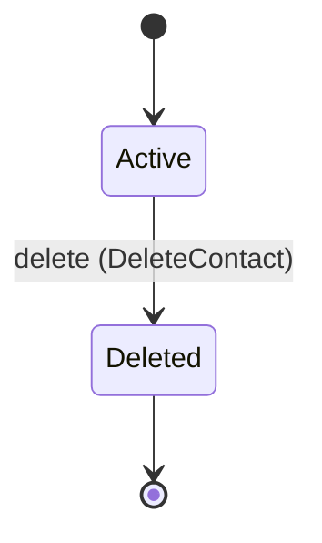
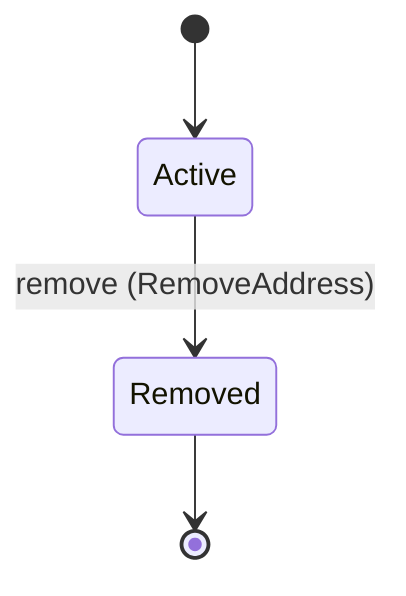

<!--
generated from softphone v1
model digest 3d66648c3a80c2b5ba8ed8e6e8d9bfcbe91e4312afd50f56a5fea9297e7297a6
contract digest 5eb12614df7df5aeb3b3839e12f5c5640ab01d1cc2674918b2cf74475eea5afc
do not edit: regenerate with `ess generate`
-->

# Phonebook

Contacts and the addresses they can be reached at. Owned by the person using the phone; the control surface never names a contact.

`softphone.directory` is one of softphone's bounded contexts. [Back to the index](../index.md).

## Types

### `AddressLabel`

`softphone.directory.AddressLabel` is one of `Mobile`, `Work`, `Home` and `Other`.

### `ContactAddressId`

`softphone.directory.ContactAddressId` wraps `Uuid` and is not interchangeable with one: the whole value of naming it separately is the crossings the model then refuses.

### `ContactAddressRow`

`softphone.directory.ContactAddressRow` is a record of five fields:

- `address_id` — `softphone.directory.ContactAddressId`
- `contact_id` — `softphone.directory.ContactId`
- `address` — `softphone.control.RemoteAddress`
- `label` — `softphone.directory.AddressLabel`
- `state` — `softphone.directory.ContactAddress.State`

### `ContactId`

`softphone.directory.ContactId` wraps `Uuid` and is not interchangeable with one: the whole value of naming it separately is the crossings the model then refuses.

### `ContactRow`

`softphone.directory.ContactRow` is a record of three fields:

- `contact_id` — `softphone.directory.ContactId`
- `display_name` — `String`
- `state` — `softphone.directory.Contact.State`

Two of the types above are reached by nothing else in this system: `softphone.directory.ContactAddressRow` and `softphone.directory.ContactRow`. No entity, view, command, event, error or crossing names them, so it is either vocabulary something outside this specification uses or a leftover — and only a person can tell which.

## Entities

An entity is what this context is about: something with an identity that outlives any one request, a shape, and a lifecycle. The lifecycle is exhaustive — a move that is not drawn below is a move this specification does not permit, and that is the only way it says so. Every move is labelled with the command that takes it, because a move nothing can trigger is refused rather than drawn.

### `Contact`

`softphone.directory.Contact`.

An instance is identified by `contact_id`, a `softphone.directory.ContactId`. The name is part of the model and not a convention: a view projects the identity under that name, so a projection inventing its own would disagree with the view.

It holds:

- `display_name` — `String`

It owns any number of [`ContactAddress`](#contactaddress), as `addresses`, carried by `ContactAddress.contact_id`.

No invariant is declared, so nothing here constrains an instance at rest.

Its state is a `softphone.directory.Contact.State`, one of `Active` and `Deleted`. That enum is synthesised from the lifecycle rather than declared beside it, so the states a view's filter compares and the states drawn below cannot disagree.

An instance is created in `Active`. `Deleted` is terminal, so an instance may rest there forever. That is declared rather than inferred from having no way out: an entity that cannot leave a state is either finished or stuck, and only its author knows which.

Each move is taken by a declared command outcome, and a move nothing takes is refused as `missing_causation` rather than left as a state change nobody can trigger:

- `delete` — taken by `softphone.directory.DeleteContact` on its `deleted` outcome

An instance is brought into existence by `softphone.directory.AddContact` on its `added` outcome.

Illegal transitions are illegal by absence: no rule forbids them, there is simply no arrow, because a rule would be a second place for the same truth to live. A diagram cannot show an absence, so the pairs it does not connect are listed here, derived from the same transitions — anything named below is a move this specification does not permit.

- `Deleted` may not become `Active`

Two views project it: [`ContactById`](#contactbyid) and [`Contacts`](#contacts).

### `ContactAddress`

`softphone.directory.ContactAddress`.

An instance is identified by `address_id`, a `softphone.directory.ContactAddressId`. The name is part of the model and not a convention: a view projects the identity under that name, so a projection inventing its own would disagree with the view.

It holds:

- `contact_id` — `softphone.directory.ContactId`
- `address` — `softphone.control.RemoteAddress`
- `label` — `softphone.directory.AddressLabel`

Its `contact_id` is what [`Contact`](#contact) owns it by, as `addresses`.

No invariant is declared, so nothing here constrains an instance at rest.

Its state is a `softphone.directory.ContactAddress.State`, one of `Active` and `Removed`. That enum is synthesised from the lifecycle rather than declared beside it, so the states a view's filter compares and the states drawn below cannot disagree.

An instance is created in `Active`. `Removed` is terminal, so an instance may rest there forever. That is declared rather than inferred from having no way out: an entity that cannot leave a state is either finished or stuck, and only its author knows which.

Each move is taken by a declared command outcome, and a move nothing takes is refused as `missing_causation` rather than left as a state change nobody can trigger:

- `remove` — taken by `softphone.directory.RemoveAddress` on its `removed` outcome

An instance is brought into existence by `softphone.directory.AddAddress` on its `added` outcome.

Illegal transitions are illegal by absence: no rule forbids them, there is simply no arrow, because a rule would be a second place for the same truth to live. A diagram cannot show an absence, so the pairs it does not connect are listed here, derived from the same transitions — anything named below is a move this specification does not permit.

- `Removed` may not become `Active`

One view projects it: [`ContactAddresses`](#contactaddresses).

## Views

A view is what the outside world is promised it can observe. Each one says which instances it contains and how soon it reflects a command that has already returned, because "you can read this" without "how soon" is the promise every flaky suite is built on.

### `ContactAddresses`

`softphone.directory.ContactAddresses`, shown to a person as "Contact addresses" and called `contact-addresses` on the wire.

It reads [`ContactAddress`](#contactaddress).

It contains the instances where `(contact_id == param.contact_id and state == Active)` holds, and only those — so an instance a caller cannot find in here has been filtered out rather than lost.

It exposes:

- `address_id` — `softphone.directory.ContactAddressId`
- `contact_id` — `softphone.directory.ContactId`
- `address` — `softphone.control.RemoteAddress`
- `label` — `softphone.directory.AddressLabel`
- `state` — `softphone.directory.ContactAddress.State`

It declares no order, so the rows come back in whatever order the implementation has, and two reads may disagree.

**Read-your-writes**: it is current the moment the command that changed it returns. A caller that has just created an invoice and cannot see it in here has been told a lie about what it did.

A generated scenario asserts it once, immediately after the command: a view promising this and not keeping the promise has to fail the suite rather than be retried until it passes.

### `ContactById`

`softphone.directory.ContactById`, shown to a person as "Contact by id" and called `contact-by-id` on the wire.

It reads [`Contact`](#contact).

It contains the instances where `contact_id == param.contact_id` holds, and only those — so an instance a caller cannot find in here has been filtered out rather than lost.

It exposes:

- `contact_id` — `softphone.directory.ContactId`
- `display_name` — `String`
- `state` — `softphone.directory.Contact.State`

It declares no order, so the rows come back in whatever order the implementation has, and two reads may disagree.

**Read-your-writes**: it is current the moment the command that changed it returns. A caller that has just created an invoice and cannot see it in here has been told a lie about what it did.

A generated scenario asserts it once, immediately after the command: a view promising this and not keeping the promise has to fail the suite rather than be retried until it passes.

### `Contacts`

`softphone.directory.Contacts`, shown to a person as "Contacts" and called `contacts` on the wire.

It reads [`Contact`](#contact).

It contains the instances where `state == Active` holds, and only those — so an instance a caller cannot find in here has been filtered out rather than lost.

It exposes:

- `contact_id` — `softphone.directory.ContactId`
- `display_name` — `String`
- `state` — `softphone.directory.Contact.State`

It declares no order, so the rows come back in whatever order the implementation has, and two reads may disagree.

**Read-your-writes**: it is current the moment the command that changed it returns. A caller that has just created an invoice and cannot see it in here has been told a lie about what it did.

A generated scenario asserts it once, immediately after the command: a view promising this and not keeping the promise has to fail the suite rather than be retried until it passes.

## Commands

### `AddAddress`

`softphone.directory.AddAddress`, shown to a person as "Add address" and called `add-address` on the wire.

It takes:

- `contact_id` — `softphone.directory.ContactId`
- `address` — `softphone.control.RemoteAddress`
- `label` — `softphone.directory.AddressLabel`

It has one outcome.

**`added`** — The default branch, taken when no other outcome's condition matched. It creates a `softphone.directory.ContactAddress`, which starts in `Active`. The new instance's identity is published as `address_id` on `softphone.directory.ContactAddressAdded`. It emits `softphone.directory.ContactAddressAdded`. It sets `contact_id` from `input.contact_id`, `address` from `input.address` and `label` from `input.label`. A test reaches it by constructing an input that satisfies no other outcome's condition.

### `AddContact`

`softphone.directory.AddContact`, shown to a person as "Add contact" and called `add-contact` on the wire.

It takes:

- `display_name` — `String`

It has one outcome.

**`added`** — The default branch, taken when no other outcome's condition matched. It creates a `softphone.directory.Contact`, which starts in `Active`. The new instance's identity is published as `contact_id` on `softphone.directory.ContactAdded`. It emits `softphone.directory.ContactAdded`. It sets `display_name` from `input.display_name`. A test reaches it by constructing an input that satisfies no other outcome's condition.

### `DeleteContact`

`softphone.directory.DeleteContact`, shown to a person as "Delete contact" and called `delete-contact` on the wire.

It takes:

- `contact_id` — `softphone.directory.ContactId`

It has two outcomes.

**`deleted`** — The default branch, taken when no other outcome's condition matched. It moves a `softphone.directory.Contact` from `Active` to `Deleted`, along the declared move `delete`. The instance is the one named by the input field `contact_id`. It emits `softphone.directory.ContactDeleted`. A test reaches it by constructing an input that satisfies no other outcome's condition.

**`wrong-state`** — Taken when the subject is resting in a state none of this command's moves start from — a `softphone.directory.Contact` in `Deleted`, which is what is left of the lifecycle once this command's own moves are taken away. The document lists none of it. No entity in this specification changes. It reports `softphone.directory.ContactStateConflict`, carrying `state`. It emits nothing. A test reaches it by driving an instance into one of those states and then issuing the command, because no input selects this branch.

### `RemoveAddress`

`softphone.directory.RemoveAddress`, shown to a person as "Remove address" and called `remove-address` on the wire.

It takes:

- `address_id` — `softphone.directory.ContactAddressId`

It has two outcomes.

**`removed`** — The default branch, taken when no other outcome's condition matched. It moves a `softphone.directory.ContactAddress` from `Active` to `Removed`, along the declared move `remove`. The instance is the one named by the input field `address_id`. It emits `softphone.directory.ContactAddressRemoved`. A test reaches it by constructing an input that satisfies no other outcome's condition.

**`wrong-state`** — Taken when the subject is resting in a state none of this command's moves start from — a `softphone.directory.ContactAddress` in `Removed`, which is what is left of the lifecycle once this command's own moves are taken away. The document lists none of it. No entity in this specification changes. It reports `softphone.directory.ContactAddressStateConflict`, carrying `state`. It emits nothing. A test reaches it by driving an instance into one of those states and then issuing the command, because no input selects this branch.

### `RenameContact`

`softphone.directory.RenameContact`, shown to a person as "Rename contact" and called `rename-contact` on the wire.

It takes:

- `contact_id` — `softphone.directory.ContactId`
- `display_name` — `String`

It has one outcome.

**`renamed`** — The default branch, taken when no other outcome's condition matched. It changes a `softphone.directory.Contact` without moving it along its lifecycle. The instance is the one named by the input field `contact_id`. It emits `softphone.directory.ContactRenamed`. It sets `display_name` from `input.display_name`. A test reaches it by constructing an input that satisfies no other outcome's condition.

## Events

### `ContactAdded`

`softphone.directory.ContactAdded`.

It carries:

- `contact_id` — `softphone.directory.ContactId`
- `display_name` — `String`

Emitted by `softphone.directory.AddContact` on its `added` outcome.

Nothing in this system reacts to it.

### `ContactAddressAdded`

`softphone.directory.ContactAddressAdded`.

It carries:

- `address_id` — `softphone.directory.ContactAddressId`
- `contact_id` — `softphone.directory.ContactId`
- `address` — `softphone.control.RemoteAddress`
- `label` — `softphone.directory.AddressLabel`

Emitted by `softphone.directory.AddAddress` on its `added` outcome.

Nothing in this system reacts to it.

### `ContactAddressRemoved`

`softphone.directory.ContactAddressRemoved`.

It carries:

- `address_id` — `softphone.directory.ContactAddressId`

Emitted by `softphone.directory.RemoveAddress` on its `removed` outcome.

Nothing in this system reacts to it.

### `ContactDeleted`

`softphone.directory.ContactDeleted`.

It carries:

- `contact_id` — `softphone.directory.ContactId`

Emitted by `softphone.directory.DeleteContact` on its `deleted` outcome.

Nothing in this system reacts to it.

### `ContactRenamed`

`softphone.directory.ContactRenamed`.

It carries:

- `contact_id` — `softphone.directory.ContactId`
- `display_name` — `String`

Emitted by `softphone.directory.RenameContact` on its `renamed` outcome.

Nothing in this system reacts to it.

## Errors

### `ContactAddressStateConflict`

The address is not in a state from which the requested change is allowed.

It carries:

- `state` — `softphone.directory.ContactAddress.State`

Reported by `softphone.directory.RemoveAddress` on its `wrong-state` outcome.

### `ContactStateConflict`

The contact is not in a state from which the requested change is allowed.

It carries:

- `state` — `softphone.directory.Contact.State`

Reported by `softphone.directory.DeleteContact` on its `wrong-state` outcome.

## Actors

An actor is who may ask this context for something. Every grant below points at a command this specification declares — a grant is a resolved reference, so "may invoke" something nobody wrote is not a permission this model can express, and an authorisation that authorises nothing cannot ship quietly.

### `Human`

`softphone.directory.Human`, shown to a person as "Human".

It may invoke [`AddAddress`](#addaddress), [`AddContact`](#addcontact), [`DeleteContact`](#deletecontact), [`RemoveAddress`](#removeaddress) and [`RenameContact`](#renamecontact).

---

Generated from softphone v1 · model digest `3d66648c3a80c2b5ba8ed8e6e8d9bfcbe91e4312afd50f56a5fea9297e7297a6` · contract digest `5eb12614df7df5aeb3b3839e12f5c5640ab01d1cc2674918b2cf74475eea5afc`. Do not edit this file; change the specification and regenerate it with `ess generate`.
