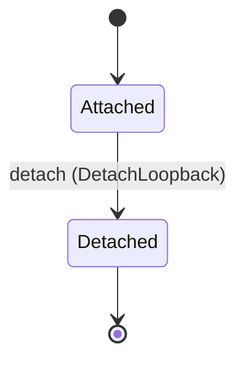

<!--
generated from softphone v1
model digest 3d66648c3a80c2b5ba8ed8e6e8d9bfcbe91e4312afd50f56a5fea9297e7297a6
contract digest 860cac750e7de2ade572e17e1e1f088b7fe81bb197e981cc7425b13336bf99b3
do not edit: regenerate with `ess generate`
-->

# Local binding

A media session carried by local audio devices. No network, no signalling, no registration — the binding whose existence is the evidence that the media layer is not the SIP layer.

`softphone.local` is one of softphone's bounded contexts. [Back to the index](../index.md).

## Types

### `DeviceRef`

`softphone.local.DeviceRef` wraps `String` and is not interchangeable with one: the whole value of naming it separately is the crossings the model then refuses.

### `LoopbackDeviceId`

`softphone.local.LoopbackDeviceId` wraps `Uuid` and is not interchangeable with one: the whole value of naming it separately is the crossings the model then refuses.

### `LoopbackDeviceRow`

`softphone.local.LoopbackDeviceRow` is a record of five fields:

- `device_id` — `softphone.local.LoopbackDeviceId`
- `session_id` — `softphone.media.MediaSessionId`
- `capture` — `softphone.local.DeviceRef`
- `render` — `softphone.local.DeviceRef`
- `state` — `softphone.local.LoopbackDevice.State`

One of the types above is reached by nothing else in this system: `softphone.local.LoopbackDeviceRow`. No entity, view, command, event, error or crossing names it, so it is either vocabulary something outside this specification uses or a leftover — and only a person can tell which.

## Entities

An entity is what this context is about: something with an identity that outlives any one request, a shape, and a lifecycle. The lifecycle is exhaustive — a move that is not drawn below is a move this specification does not permit, and that is the only way it says so. Every move is labelled with the command that takes it, because a move nothing can trigger is refused rather than drawn.

### `LoopbackDevice`

`softphone.local.LoopbackDevice`.

An instance is identified by `device_id`, a `softphone.local.LoopbackDeviceId`. The name is part of the model and not a convention: a view projects the identity under that name, so a projection inventing its own would disagree with the view.

It holds:

- `session_id` — `softphone.media.MediaSessionId`
- `capture` — `softphone.local.DeviceRef`
- `render` — `softphone.local.DeviceRef`

It references at most one [`softphone.media.MediaSession`](softphone-media.md#mediasession), as `session`, carried by `LoopbackDevice.session_id`.

No invariant is declared, so nothing here constrains an instance at rest.

Its state is a `softphone.local.LoopbackDevice.State`, one of `Attached` and `Detached`. That enum is synthesised from the lifecycle rather than declared beside it, so the states a view's filter compares and the states drawn below cannot disagree.

An instance is created in `Attached`. `Detached` is terminal, so an instance may rest there forever. That is declared rather than inferred from having no way out: an entity that cannot leave a state is either finished or stuck, and only its author knows which.

Each move is taken by a declared command outcome, and a move nothing takes is refused as `missing_causation` rather than left as a state change nobody can trigger:

- `detach` — taken by `softphone.local.DetachLoopback` on its `detached` outcome

An instance is brought into existence by `softphone.local.AttachLoopback` on its `attached` outcome.

Illegal transitions are illegal by absence: no rule forbids them, there is simply no arrow, because a rule would be a second place for the same truth to live. A diagram cannot show an absence, so the pairs it does not connect are listed here, derived from the same transitions — anything named below is a move this specification does not permit.

- `Detached` may not become `Attached`

One view projects it: [`LoopbackDeviceById`](#loopbackdevicebyid).

## Views

A view is what the outside world is promised it can observe. Each one says which instances it contains and how soon it reflects a command that has already returned, because "you can read this" without "how soon" is the promise every flaky suite is built on.

### `LoopbackDeviceById`

`softphone.local.LoopbackDeviceById`, shown to a person as "Loopback device by id" and called `loopback-device-by-id` on the wire.

It reads [`LoopbackDevice`](#loopbackdevice).

It contains the instances where `device_id == param.device_id` holds, and only those — so an instance a caller cannot find in here has been filtered out rather than lost.

It exposes:

- `device_id` — `softphone.local.LoopbackDeviceId`
- `session_id` — `softphone.media.MediaSessionId`
- `capture` — `softphone.local.DeviceRef`
- `render` — `softphone.local.DeviceRef`
- `state` — `softphone.local.LoopbackDevice.State`

It declares no order, so the rows come back in whatever order the implementation has, and two reads may disagree.

**Read-your-writes**: it is current the moment the command that changed it returns. A caller that has just created an invoice and cannot see it in here has been told a lie about what it did.

A generated scenario asserts it once, immediately after the command: a view promising this and not keeping the promise has to fail the suite rather than be retried until it passes.

## Commands

### `AttachLoopback`

`softphone.local.AttachLoopback`, shown to a person as "Attach loopback" and called `attach-loopback` on the wire.

It takes:

- `session_id` — `softphone.media.MediaSessionId`
- `capture` — `softphone.local.DeviceRef`
- `render` — `softphone.local.DeviceRef`

It has one outcome.

**`attached`** — The only outcome that creates a `LoopbackDevice`. The default branch, taken when no other outcome's condition matched. It creates a `softphone.local.LoopbackDevice`, which starts in `Attached`. The new instance's identity is published as `device_id` on `softphone.local.LoopbackAttached`. It emits `softphone.local.LoopbackAttached`. It sets `session_id` from `input.session_id`, `capture` from `input.capture` and `render` from `input.render`. A test reaches it by constructing an input that satisfies no other outcome's condition.

### `DetachLoopback`

`softphone.local.DetachLoopback`, shown to a person as "Detach loopback" and called `detach-loopback` on the wire.

It takes:

- `device_id` — `softphone.local.LoopbackDeviceId`
- `session_id` — `softphone.media.MediaSessionId`
- `reason` — `softphone.media.TerminationReason`

It has two outcomes.

**`detached`** — The default branch, taken when no other outcome's condition matched. It moves a `softphone.local.LoopbackDevice` from `Attached` to `Detached`, along the declared move `detach`. The instance is the one named by the input field `device_id`. It emits `softphone.local.LoopbackDetached`. A test reaches it by constructing an input that satisfies no other outcome's condition.

**`wrong-state`** — Taken when the subject is resting in a state none of this command's moves start from — a `softphone.local.LoopbackDevice` in `Detached`, which is what is left of the lifecycle once this command's own moves are taken away. The document lists none of it. No entity in this specification changes. It reports `softphone.local.LoopbackDeviceStateConflict`, carrying `state`. It emits nothing. A test reaches it by driving an instance into one of those states and then issuing the command, because no input selects this branch.

## Events

### `LoopbackAttached`

`softphone.local.LoopbackAttached`.

It carries:

- `device_id` — `softphone.local.LoopbackDeviceId`
- `session_id` — `softphone.media.MediaSessionId`
- `capture` — `softphone.local.DeviceRef`
- `render` — `softphone.local.DeviceRef`

Emitted by `softphone.local.AttachLoopback` on its `attached` outcome.

Nothing in this system reacts to it.

### `LoopbackDetached`

`softphone.local.LoopbackDetached`.

It carries:

- `device_id` — `softphone.local.LoopbackDeviceId`
- `session_id` — `softphone.media.MediaSessionId`
- `reason` — `softphone.media.TerminationReason`

Emitted by `softphone.local.DetachLoopback` on its `detached` outcome.

`end-session-with-loopback` reacts to it — see [Interactions](../interactions.md).

## Errors

### `LoopbackDeviceStateConflict`

The device is not in a state from which the requested change is allowed.

It carries:

- `state` — `softphone.local.LoopbackDevice.State`

Reported by `softphone.local.DetachLoopback` on its `wrong-state` outcome.

## Actors

An actor is who may ask this context for something. Every grant below points at a command this specification declares — a grant is a resolved reference, so "may invoke" something nobody wrote is not a permission this model can express, and an authorisation that authorises nothing cannot ship quietly.

### `LocalHost`

`softphone.local.LocalHost`, shown to a person as "Local host".

It may invoke [`AttachLoopback`](#attachloopback) and [`DetachLoopback`](#detachloopback).

---

Generated from softphone v1 · model digest `3d66648c3a80c2b5ba8ed8e6e8d9bfcbe91e4312afd50f56a5fea9297e7297a6` · contract digest `860cac750e7de2ade572e17e1e1f088b7fe81bb197e981cc7425b13336bf99b3`. Do not edit this file; change the specification and regenerate it with `ess generate`.
