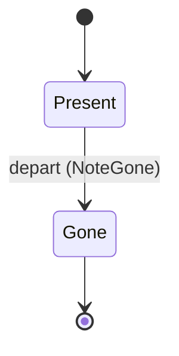
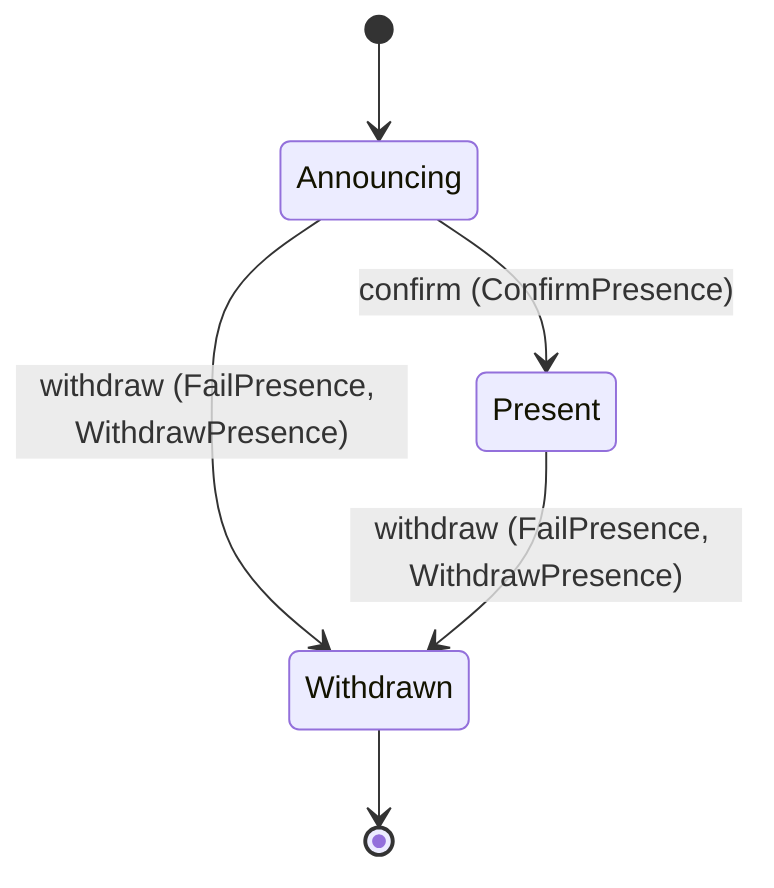

<!--
generated from softphone v1
model digest 522f372d9f45cae05577d8379ac02cac26b458beceb66dea739471ba4f91e59e
contract digest ac3ebcbb85aa66ce78c6add077d0f2a298ebe79b578d5370a557dfeff79b96d6
do not edit: regenerate with `ess generate`
-->

# Presence

This phone's standing with the server it announced itself to, and the other phones it has been told about. One roster per page, told rather than shared.

`softphone.presence` is one of softphone's bounded contexts. [Back to the index](../index.md).

## Types

### `DisplayName`

`softphone.presence.DisplayName` wraps `String` and is not interchangeable with one: the whole value of naming it separately is the crossings the model then refuses.

### `PeerPhoneRow`

`softphone.presence.PeerPhoneRow` is a record of three fields:

- `handle` — `softphone.presence.PhoneHandle`
- `label` — `softphone.presence.DisplayName`
- `state` — `softphone.presence.PeerPhone.State`

### `PhoneHandle`

`softphone.presence.PhoneHandle` wraps `String` and is not interchangeable with one: the whole value of naming it separately is the crossings the model then refuses.

### `PresenceCause`

`softphone.presence.PresenceCause` is one of `Local`, `Transport` and `Refused`.

### `PresenceId`

`softphone.presence.PresenceId` wraps `Uuid` and is not interchangeable with one: the whole value of naming it separately is the crossings the model then refuses.

### `PresenceRow`

`softphone.presence.PresenceRow` is a record of five fields:

- `presence_id` — `softphone.presence.PresenceId`
- `handle` — `softphone.presence.PhoneHandle`
- `label` — `softphone.presence.DisplayName`
- `cause` — `Optional<softphone.presence.PresenceCause>`, which may be absent
- `state` — `softphone.presence.Presence.State`

Two of the types above are reached by nothing else in this system: `softphone.presence.PeerPhoneRow` and `softphone.presence.PresenceRow`. No entity, view, command, event, error or crossing names them, so it is either vocabulary something outside this specification uses or a leftover — and only a person can tell which.

## Entities

An entity is what this context is about: something with an identity that outlives any one request, a shape, and a lifecycle. The lifecycle is exhaustive — a move that is not drawn below is a move this specification does not permit, and that is the only way it says so. Every move is labelled with the command that takes it, because a move nothing can trigger is refused rather than drawn.

### `PeerPhone`

`softphone.presence.PeerPhone`.

An instance is identified by `handle`, a `softphone.presence.PhoneHandle`. The name is part of the model and not a convention: a view projects the identity under that name, so a projection inventing its own would disagree with the view.

It holds:

- `label` — `softphone.presence.DisplayName`

It declares no relation to another entity, and no other entity names it.

No invariant is declared, so nothing here constrains an instance at rest.

Its state is a `softphone.presence.PeerPhone.State`, one of `Gone` and `Present`. That enum is synthesised from the lifecycle rather than declared beside it, so the states a view's filter compares and the states drawn below cannot disagree.

An instance is created in `Present`. `Gone` is terminal, so an instance may rest there forever. That is declared rather than inferred from having no way out: an entity that cannot leave a state is either finished or stuck, and only its author knows which.

Each move is taken by a declared command outcome, and a move nothing takes is refused as `missing_causation` rather than left as a state change nobody can trigger:

- `depart` — taken by `softphone.presence.NoteGone` on its `noted` outcome

An instance is brought into existence by `softphone.presence.NotePresent` on its `noted` outcome.

Illegal transitions are illegal by absence: no rule forbids them, there is simply no arrow, because a rule would be a second place for the same truth to live. A diagram cannot show an absence, so the pairs it does not connect are listed here, derived from the same transitions — anything named below is a move this specification does not permit.

- `Gone` may not become `Present`

Two views project it: [`PhoneByHandle`](#phonebyhandle) and [`PresentPhones`](#presentphones).

### `Presence`

`softphone.presence.Presence`.

An instance is identified by `presence_id`, a `softphone.presence.PresenceId`. The name is part of the model and not a convention: a view projects the identity under that name, so a projection inventing its own would disagree with the view.

It holds:

- `handle` — `softphone.presence.PhoneHandle`
- `label` — `softphone.presence.DisplayName`
- `cause` — `Optional<softphone.presence.PresenceCause>`, which may be absent

It declares no relation to another entity, and no other entity names it.

Every instance satisfies `(not (state == Withdrawn) or defined(cause))` — a predicate over this entity's own fields, checked against them rather than stored as a sentence, so an invariant reading something the entity does not have is refused instead of documented.

Its state is a `softphone.presence.Presence.State`, one of `Announcing`, `Present` and `Withdrawn`. That enum is synthesised from the lifecycle rather than declared beside it, so the states a view's filter compares and the states drawn below cannot disagree.

An instance is created in `Announcing`. `Withdrawn` is terminal, so an instance may rest there forever. That is declared rather than inferred from having no way out: an entity that cannot leave a state is either finished or stuck, and only its author knows which.

Each move is taken by a declared command outcome, and a move nothing takes is refused as `missing_causation` rather than left as a state change nobody can trigger:

- `confirm` — taken by `softphone.presence.ConfirmPresence` on its `confirmed` outcome
- `withdraw` — taken by `softphone.presence.FailPresence` on its `failed` outcome and `softphone.presence.WithdrawPresence` on its `withdrawn` outcome

An instance is brought into existence by `softphone.presence.AnnouncePresence` on its `announcing` outcome.

Illegal transitions are illegal by absence: no rule forbids them, there is simply no arrow, because a rule would be a second place for the same truth to live. A diagram cannot show an absence, so the pairs it does not connect are listed here, derived from the same transitions — anything named below is a move this specification does not permit.

- `Present` may not become `Announcing`
- `Withdrawn` may not become `Announcing`
- `Withdrawn` may not become `Present`

One view projects it: [`MyPresence`](#mypresence).

## Views

A view is what the outside world is promised it can observe. Each one says which instances it contains and how soon it reflects a command that has already returned, because "you can read this" without "how soon" is the promise every flaky suite is built on.

### `MyPresence`

`softphone.presence.MyPresence`, shown to a person as "My presence" and called `my-presence` on the wire.

It reads [`Presence`](#presence).

It contains the instances where `state == Present` holds, and only those — so an instance a caller cannot find in here has been filtered out rather than lost.

It exposes:

- `presence_id` — `softphone.presence.PresenceId`
- `handle` — `softphone.presence.PhoneHandle`
- `label` — `softphone.presence.DisplayName`
- `cause` — `Optional<softphone.presence.PresenceCause>`, which may be absent
- `state` — `softphone.presence.Presence.State`

It declares no order, so the rows come back in whatever order the implementation has, and two reads may disagree.

**Read-your-writes**: it is current the moment the command that changed it returns. A caller that has just created an invoice and cannot see it in here has been told a lie about what it did.

A generated scenario asserts it once, immediately after the command: a view promising this and not keeping the promise has to fail the suite rather than be retried until it passes.

### `PhoneByHandle`

`softphone.presence.PhoneByHandle`, shown to a person as "Phone by handle" and called `phone-by-handle` on the wire.

It reads [`PeerPhone`](#peerphone).

It contains the instances where `handle == param.handle` holds, and only those — so an instance a caller cannot find in here has been filtered out rather than lost.

It exposes:

- `handle` — `softphone.presence.PhoneHandle`
- `label` — `softphone.presence.DisplayName`
- `state` — `softphone.presence.PeerPhone.State`

It declares no order, so the rows come back in whatever order the implementation has, and two reads may disagree.

**Read-your-writes**: it is current the moment the command that changed it returns. A caller that has just created an invoice and cannot see it in here has been told a lie about what it did.

A generated scenario asserts it once, immediately after the command: a view promising this and not keeping the promise has to fail the suite rather than be retried until it passes.

### `PresentPhones`

`softphone.presence.PresentPhones`, shown to a person as "Present phones" and called `present-phones` on the wire.

It reads [`PeerPhone`](#peerphone).

It contains the instances where `state == Present` holds, and only those — so an instance a caller cannot find in here has been filtered out rather than lost.

It exposes:

- `handle` — `softphone.presence.PhoneHandle`
- `label` — `softphone.presence.DisplayName`
- `state` — `softphone.presence.PeerPhone.State`

It declares no order, so the rows come back in whatever order the implementation has, and two reads may disagree.

**Read-your-writes**: it is current the moment the command that changed it returns. A caller that has just created an invoice and cannot see it in here has been told a lie about what it did.

A generated scenario asserts it once, immediately after the command: a view promising this and not keeping the promise has to fail the suite rather than be retried until it passes.

## Commands

### `AnnouncePresence`

`softphone.presence.AnnouncePresence`, shown to a person as "Announce presence" and called `announce-presence` on the wire.

It takes:

- `handle` — `softphone.presence.PhoneHandle`
- `label` — `softphone.presence.DisplayName`

It has one outcome.

**`announcing`** — The only outcome that creates a `Presence`. The handle is asked for rather than assigned: the server accepts it or refuses it, and until then this phone is reachable by nobody. The default branch, taken when no other outcome's condition matched. It creates a `softphone.presence.Presence`, which starts in `Announcing`. The new instance's identity is published as `presence_id` on `softphone.presence.PresenceAnnounced`. It emits `softphone.presence.PresenceAnnounced`. It sets `handle` from `input.handle` and `label` from `input.label`. A test reaches it by constructing an input that satisfies no other outcome's condition.

### `ConfirmPresence`

`softphone.presence.ConfirmPresence`, shown to a person as "Confirm presence" and called `confirm-presence` on the wire.

It takes:

- `presence_id` — `softphone.presence.PresenceId`

It has two outcomes.

**`confirmed`** — The default branch, taken when no other outcome's condition matched. It moves a `softphone.presence.Presence` from `Announcing` to `Present`, along the declared move `confirm`. The instance is the one named by the input field `presence_id`. It emits `softphone.presence.PresenceConfirmed`. A test reaches it by constructing an input that satisfies no other outcome's condition.

**`wrong-state`** — Taken when the subject is resting in a state none of this command's moves start from — a `softphone.presence.Presence` in `Present` and `Withdrawn`, which is what is left of the lifecycle once this command's own moves are taken away. The document lists none of it. No entity in this specification changes. It reports `softphone.presence.PresenceStateConflict`, carrying `state`. It emits nothing. A test reaches it by driving an instance into one of those states and then issuing the command, because no input selects this branch.

### `FailPresence`

`softphone.presence.FailPresence`, shown to a person as "Fail presence" and called `fail-presence` on the wire.

It takes:

- `presence_id` — `softphone.presence.PresenceId`
- `cause` — `softphone.presence.PresenceCause`

It has two outcomes.

**`failed`** — A handle somebody else holds and a connection that died are the same move with a different cause. Both leave this phone unreachable, which is the only thing the roster can act on. The default branch, taken when no other outcome's condition matched. It moves a `softphone.presence.Presence` from `Announcing` and `Present` to `Withdrawn`, along the declared move `withdraw`. The instance is the one named by the input field `presence_id`. It emits `softphone.presence.PresenceFailed`. It sets `cause` from `input.cause`. A test reaches it by constructing an input that satisfies no other outcome's condition.

**`wrong-state`** — Taken when the subject is resting in a state none of this command's moves start from — a `softphone.presence.Presence` in `Withdrawn`, which is what is left of the lifecycle once this command's own moves are taken away. The document lists none of it. No entity in this specification changes. It reports `softphone.presence.PresenceStateConflict`, carrying `state`. It emits nothing. A test reaches it by driving an instance into one of those states and then issuing the command, because no input selects this branch.

### `NoteGone`

`softphone.presence.NoteGone`, shown to a person as "Note gone" and called `note-gone` on the wire.

It takes:

- `handle` — `softphone.presence.PhoneHandle`

It has two outcomes.

**`noted`** — The default branch, taken when no other outcome's condition matched. It moves a `softphone.presence.PeerPhone` from `Present` to `Gone`, along the declared move `depart`. The instance is the one named by the input field `handle`. It emits `softphone.presence.PeerGone`. A test reaches it by constructing an input that satisfies no other outcome's condition.

**`wrong-state`** — Taken when the subject is resting in a state none of this command's moves start from — a `softphone.presence.PeerPhone` in `Gone`, which is what is left of the lifecycle once this command's own moves are taken away. The document lists none of it. No entity in this specification changes. It reports `softphone.presence.PeerPhoneStateConflict`, carrying `state`. It emits nothing. A test reaches it by driving an instance into one of those states and then issuing the command, because no input selects this branch.

### `NotePresent`

`softphone.presence.NotePresent`, shown to a person as "Note present" and called `note-present` on the wire.

It takes:

- `handle` — `softphone.presence.PhoneHandle`
- `label` — `softphone.presence.DisplayName`

It has one outcome.

**`noted`** — The default branch, taken when no other outcome's condition matched. It creates a `softphone.presence.PeerPhone`, which starts in `Present`. The new instance's identity is published as `handle` on `softphone.presence.PeerPresent`. It emits `softphone.presence.PeerPresent`. It sets `label` from `input.label`. A test reaches it by constructing an input that satisfies no other outcome's condition.

### `WithdrawPresence`

`softphone.presence.WithdrawPresence`, shown to a person as "Withdraw presence" and called `withdraw-presence` on the wire.

It takes:

- `presence_id` — `softphone.presence.PresenceId`

It has two outcomes.

**`withdrawn`** — The cause is not an input. This command is the local decision, so `Local` is the only class it could carry, and asking the caller for it would let a page report its own withdrawal as a transport failure. The default branch, taken when no other outcome's condition matched. It moves a `softphone.presence.Presence` from `Announcing` and `Present` to `Withdrawn`, along the declared move `withdraw`. The instance is the one named by the input field `presence_id`. It emits `softphone.presence.PresenceWithdrawn`. It sets `cause` from `"Local"`. A test reaches it by constructing an input that satisfies no other outcome's condition.

**`wrong-state`** — Taken when the subject is resting in a state none of this command's moves start from — a `softphone.presence.Presence` in `Withdrawn`, which is what is left of the lifecycle once this command's own moves are taken away. The document lists none of it. No entity in this specification changes. It reports `softphone.presence.PresenceStateConflict`, carrying `state`. It emits nothing. A test reaches it by driving an instance into one of those states and then issuing the command, because no input selects this branch.

## Events

### `PeerGone`

`softphone.presence.PeerGone`.

It carries:

- `handle` — `softphone.presence.PhoneHandle`

Emitted by `softphone.presence.NoteGone` on its `noted` outcome.

Nothing in this system reacts to it.

### `PeerPresent`

`softphone.presence.PeerPresent`.

It carries:

- `handle` — `softphone.presence.PhoneHandle`
- `label` — `softphone.presence.DisplayName`

Emitted by `softphone.presence.NotePresent` on its `noted` outcome.

Nothing in this system reacts to it.

### `PresenceAnnounced`

`softphone.presence.PresenceAnnounced`.

It carries:

- `presence_id` — `softphone.presence.PresenceId`
- `handle` — `softphone.presence.PhoneHandle`
- `label` — `softphone.presence.DisplayName`

Emitted by `softphone.presence.AnnouncePresence` on its `announcing` outcome.

Nothing in this system reacts to it.

### `PresenceConfirmed`

`softphone.presence.PresenceConfirmed`.

It carries:

- `presence_id` — `softphone.presence.PresenceId`

Emitted by `softphone.presence.ConfirmPresence` on its `confirmed` outcome.

Nothing in this system reacts to it.

### `PresenceFailed`

`softphone.presence.PresenceFailed`.

It carries:

- `presence_id` — `softphone.presence.PresenceId`
- `cause` — `softphone.presence.PresenceCause`

Emitted by `softphone.presence.FailPresence` on its `failed` outcome.

Nothing in this system reacts to it.

### `PresenceWithdrawn`

`softphone.presence.PresenceWithdrawn`.

It carries:

- `presence_id` — `softphone.presence.PresenceId`

Emitted by `softphone.presence.WithdrawPresence` on its `withdrawn` outcome.

Nothing in this system reacts to it.

## Errors

### `PeerPhoneStateConflict`

The phone is not in a state from which the requested change is allowed.

It carries:

- `state` — `softphone.presence.PeerPhone.State`

Reported by `softphone.presence.NoteGone` on its `wrong-state` outcome.

### `PresenceStateConflict`

The presence is not in a state from which the requested change is allowed.

It carries:

- `state` — `softphone.presence.Presence.State`

Reported by `softphone.presence.ConfirmPresence` on its `wrong-state` outcome.

Reported by `softphone.presence.FailPresence` on its `wrong-state` outcome.

Reported by `softphone.presence.WithdrawPresence` on its `wrong-state` outcome.

## Actors

An actor is who may ask this context for something. Every grant below points at a command this specification declares — a grant is a resolved reference, so "may invoke" something nobody wrote is not a permission this model can express, and an authorisation that authorises nothing cannot ship quietly.

### `Kernel`

`softphone.presence.Kernel`, shown to a person as "Signalling kernel".

It may invoke [`ConfirmPresence`](#confirmpresence), [`FailPresence`](#failpresence), [`NoteGone`](#notegone) and [`NotePresent`](#notepresent).

### `PresenceHost`

`softphone.presence.PresenceHost`, shown to a person as "Presence host".

It may invoke [`AnnouncePresence`](#announcepresence) and [`WithdrawPresence`](#withdrawpresence).

---

Generated from softphone v1 · model digest `522f372d9f45cae05577d8379ac02cac26b458beceb66dea739471ba4f91e59e` · contract digest `ac3ebcbb85aa66ce78c6add077d0f2a298ebe79b578d5370a557dfeff79b96d6`. Do not edit this file; change the specification and regenerate it with `ess generate`.
