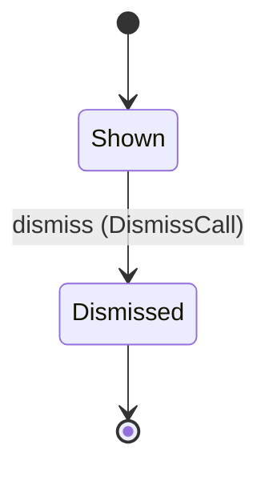
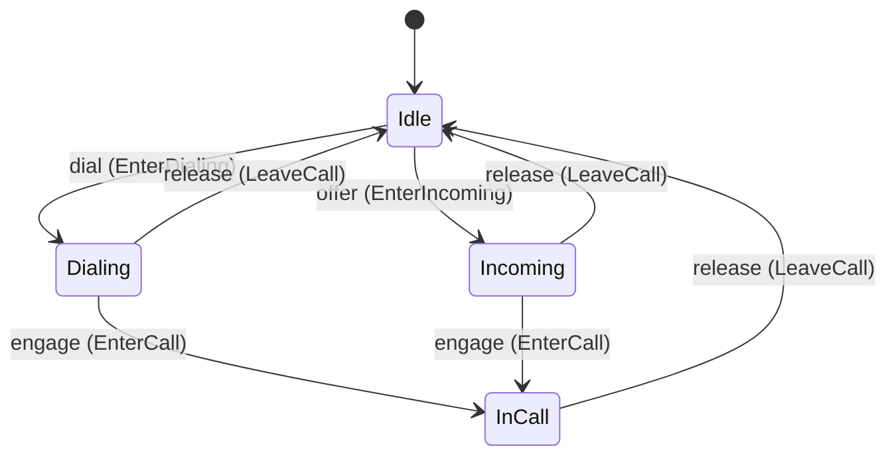
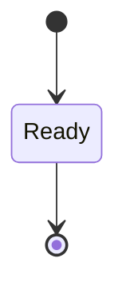

<!--
generated from softphone v1
model digest 522f372d9f45cae05577d8379ac02cac26b458beceb66dea739471ba4f91e59e
contract digest 4480f92e0592ffdfecbde1077be7aa4bc01faacef18dc83ee830ec5e2717952b
do not edit: regenerate with `ess generate`
-->

# Phone console

A keypad holding a partially typed address, and one tile per call carrying the contact name to show. The only domain a page reads directly.

`softphone.presentation` is one of softphone's bounded contexts. [Back to the index](../index.md).

## Types

### `CallTileId`

`softphone.presentation.CallTileId` wraps `Uuid` and is not interchangeable with one: the whole value of naming it separately is the crossings the model then refuses.

### `CallTileRow`

`softphone.presentation.CallTileRow` is a record of four fields:

- `tile_id` — `softphone.presentation.CallTileId`
- `call_id` — `softphone.control.CallId`
- `contact_id` — `Optional<softphone.directory.ContactId>`, which may be absent
- `state` — `softphone.presentation.CallTile.State`

### `ConsoleId`

`softphone.presentation.ConsoleId` wraps `Uuid` and is not interchangeable with one: the whole value of naming it separately is the crossings the model then refuses.

### `ConsoleRow`

`softphone.presentation.ConsoleRow` is a record of three fields:

- `console_id` — `softphone.presentation.ConsoleId`
- `active_tile` — `Optional<softphone.presentation.CallTileId>`, which may be absent
- `state` — `softphone.presentation.Console.State`

### `KeypadId`

`softphone.presentation.KeypadId` wraps `Uuid` and is not interchangeable with one: the whole value of naming it separately is the crossings the model then refuses.

### `KeypadRow`

`softphone.presentation.KeypadRow` is a record of three fields:

- `keypad_id` — `softphone.presentation.KeypadId`
- `entry` — `String`
- `state` — `softphone.presentation.Keypad.State`

Three of the types above are reached by nothing else in this system: `softphone.presentation.CallTileRow`, `softphone.presentation.ConsoleRow` and `softphone.presentation.KeypadRow`. No entity, view, command, event, error or crossing names them, so it is either vocabulary something outside this specification uses or a leftover — and only a person can tell which.

## Entities

An entity is what this context is about: something with an identity that outlives any one request, a shape, and a lifecycle. The lifecycle is exhaustive — a move that is not drawn below is a move this specification does not permit, and that is the only way it says so. Every move is labelled with the command that takes it, because a move nothing can trigger is refused rather than drawn.

### `CallTile`

`softphone.presentation.CallTile`.

An instance is identified by `tile_id`, a `softphone.presentation.CallTileId`. The name is part of the model and not a convention: a view projects the identity under that name, so a projection inventing its own would disagree with the view.

It holds:

- `call_id` — `softphone.control.CallId`
- `contact_id` — `Optional<softphone.directory.ContactId>`, which may be absent

It references at most one [`softphone.control.Call`](softphone-control.md#call), as `call`, carried by `CallTile.call_id`. It references at most one [`softphone.directory.Contact`](softphone-directory.md#contact), as `contact`, carried by `CallTile.contact_id`.

No invariant is declared, so nothing here constrains an instance at rest.

Its state is a `softphone.presentation.CallTile.State`, one of `Dismissed` and `Shown`. That enum is synthesised from the lifecycle rather than declared beside it, so the states a view's filter compares and the states drawn below cannot disagree.

An instance is created in `Shown`. `Dismissed` is terminal, so an instance may rest there forever. That is declared rather than inferred from having no way out: an entity that cannot leave a state is either finished or stuck, and only its author knows which.

Each move is taken by a declared command outcome, and a move nothing takes is refused as `missing_causation` rather than left as a state change nobody can trigger:

- `dismiss` — taken by `softphone.presentation.DismissCall` on its `dismissed` outcome

An instance is brought into existence by `softphone.presentation.ShowCall` on its `shown` outcome.

Illegal transitions are illegal by absence: no rule forbids them, there is simply no arrow, because a rule would be a second place for the same truth to live. A diagram cannot show an absence, so the pairs it does not connect are listed here, derived from the same transitions — anything named below is a move this specification does not permit.

- `Dismissed` may not become `Shown`

One view projects it: [`CallTiles`](#calltiles).

### `Console`

`softphone.presentation.Console`.

An instance is identified by `console_id`, a `softphone.presentation.ConsoleId`. The name is part of the model and not a convention: a view projects the identity under that name, so a projection inventing its own would disagree with the view.

It holds:

- `active_tile` — `Optional<softphone.presentation.CallTileId>`, which may be absent

It declares no relation to another entity, and no other entity names it.

No invariant is declared, so nothing here constrains an instance at rest.

Its state is a `softphone.presentation.Console.State`, one of `Dialing`, `Idle`, `InCall` and `Incoming`. That enum is synthesised from the lifecycle rather than declared beside it, so the states a view's filter compares and the states drawn below cannot disagree.

An instance is created in `Idle`. No state is terminal: nothing in this lifecycle says an instance may stop moving.

Each move is taken by a declared command outcome, and a move nothing takes is refused as `missing_causation` rather than left as a state change nobody can trigger:

- `dial` — taken by `softphone.presentation.EnterDialing` on its `dialing` outcome
- `offer` — taken by `softphone.presentation.EnterIncoming` on its `incoming` outcome
- `engage` — taken by `softphone.presentation.EnterCall` on its `engaged` outcome
- `release` — taken by `softphone.presentation.LeaveCall` on its `released` outcome

An instance is brought into existence by `softphone.presentation.OpenConsole` on its `opened` outcome.

Illegal transitions are illegal by absence: no rule forbids them, there is simply no arrow, because a rule would be a second place for the same truth to live. A diagram cannot show an absence, so the pairs it does not connect are listed here, derived from the same transitions — anything named below is a move this specification does not permit.

- `Dialing` may not become `Incoming`
- `Idle` may not become `InCall`
- `InCall` may not become `Dialing`
- `InCall` may not become `Incoming`
- `Incoming` may not become `Dialing`

One view projects it: [`ConsoleById`](#consolebyid).

### `Keypad`

`softphone.presentation.Keypad`.

An instance is identified by `keypad_id`, a `softphone.presentation.KeypadId`. The name is part of the model and not a convention: a view projects the identity under that name, so a projection inventing its own would disagree with the view.

It holds:

- `entry` — `String`

It declares no relation to another entity, and no other entity names it.

No invariant is declared, so nothing here constrains an instance at rest.

Its state is a `softphone.presentation.Keypad.State`, one of `Ready`. That enum is synthesised from the lifecycle rather than declared beside it, so the states a view's filter compares and the states drawn below cannot disagree.

An instance is created in `Ready`. `Ready` is terminal, so an instance may rest there forever. That is declared rather than inferred from having no way out: an entity that cannot leave a state is either finished or stuck, and only its author knows which.

It declares no moves, so nothing changes its state once it exists.

It has one state, so there is no move to permit or to forbid.

One view projects it: [`KeypadById`](#keypadbyid).

## Views

A view is what the outside world is promised it can observe. Each one says which instances it contains and how soon it reflects a command that has already returned, because "you can read this" without "how soon" is the promise every flaky suite is built on.

### `CallTiles`

`softphone.presentation.CallTiles`, shown to a person as "Call tiles" and called `call-tiles` on the wire.

It reads [`CallTile`](#calltile).

It contains the instances where `state == Shown` holds, and only those — so an instance a caller cannot find in here has been filtered out rather than lost.

It exposes:

- `tile_id` — `softphone.presentation.CallTileId`
- `call_id` — `softphone.control.CallId`
- `contact_id` — `Optional<softphone.directory.ContactId>`, which may be absent
- `state` — `softphone.presentation.CallTile.State`

It declares no order, so the rows come back in whatever order the implementation has, and two reads may disagree.

**Read-your-writes**: it is current the moment the command that changed it returns. A caller that has just created an invoice and cannot see it in here has been told a lie about what it did.

A generated scenario asserts it once, immediately after the command: a view promising this and not keeping the promise has to fail the suite rather than be retried until it passes.

### `ConsoleById`

`softphone.presentation.ConsoleById`, shown to a person as "Console by id" and called `console-by-id` on the wire.

It reads [`Console`](#console).

It contains the instances where `console_id == param.console_id` holds, and only those — so an instance a caller cannot find in here has been filtered out rather than lost.

It exposes:

- `console_id` — `softphone.presentation.ConsoleId`
- `active_tile` — `Optional<softphone.presentation.CallTileId>`, which may be absent
- `state` — `softphone.presentation.Console.State`

It declares no order, so the rows come back in whatever order the implementation has, and two reads may disagree.

**Read-your-writes**: it is current the moment the command that changed it returns. A caller that has just created an invoice and cannot see it in here has been told a lie about what it did.

A generated scenario asserts it once, immediately after the command: a view promising this and not keeping the promise has to fail the suite rather than be retried until it passes.

### `KeypadById`

`softphone.presentation.KeypadById`, shown to a person as "Keypad by id" and called `keypad-by-id` on the wire.

It reads [`Keypad`](#keypad).

It contains the instances where `keypad_id == param.keypad_id` holds, and only those — so an instance a caller cannot find in here has been filtered out rather than lost.

It exposes:

- `keypad_id` — `softphone.presentation.KeypadId`
- `entry` — `String`
- `state` — `softphone.presentation.Keypad.State`

It declares no order, so the rows come back in whatever order the implementation has, and two reads may disagree.

**Read-your-writes**: it is current the moment the command that changed it returns. A caller that has just created an invoice and cannot see it in here has been told a lie about what it did.

A generated scenario asserts it once, immediately after the command: a view promising this and not keeping the promise has to fail the suite rather than be retried until it passes.

## Commands

### `AttributeTile`

`softphone.presentation.AttributeTile`, shown to a person as "Attribute tile" and called `attribute-tile` on the wire.

It takes:

- `tile_id` — `softphone.presentation.CallTileId`
- `contact_id` — `Optional<softphone.directory.ContactId>`, which may be absent

It has one outcome.

**`attributed`** — An absent `contact_id` clears the name and the tile shows the address instead. The default branch, taken when no other outcome's condition matched. It changes a `softphone.presentation.CallTile` without moving it along its lifecycle. The instance is the one named by the input field `tile_id`. It emits `softphone.presentation.TileAttributed`. It sets `contact_id` from `input.contact_id`. A test reaches it by constructing an input that satisfies no other outcome's condition.

### `ClearEntry`

`softphone.presentation.ClearEntry`, shown to a person as "Clear entry" and called `clear-entry` on the wire.

It takes:

- `keypad_id` — `softphone.presentation.KeypadId`

It has one outcome.

**`cleared`** — The default branch, taken when no other outcome's condition matched. It changes a `softphone.presentation.Keypad` without moving it along its lifecycle. The instance is the one named by the input field `keypad_id`. It emits `softphone.presentation.EntryCleared`. It sets `entry` from `""`. A test reaches it by constructing an input that satisfies no other outcome's condition.

### `DismissCall`

`softphone.presentation.DismissCall`, shown to a person as "Dismiss call" and called `dismiss-call` on the wire.

It takes:

- `tile_id` — `softphone.presentation.CallTileId`

It has two outcomes.

**`dismissed`** — The default branch, taken when no other outcome's condition matched. It moves a `softphone.presentation.CallTile` from `Shown` to `Dismissed`, along the declared move `dismiss`. The instance is the one named by the input field `tile_id`. It emits `softphone.presentation.CallDismissed`. A test reaches it by constructing an input that satisfies no other outcome's condition.

**`wrong-state`** — Taken when the subject is resting in a state none of this command's moves start from — a `softphone.presentation.CallTile` in `Dismissed`, which is what is left of the lifecycle once this command's own moves are taken away. The document lists none of it. No entity in this specification changes. It reports `softphone.presentation.CallTileStateConflict`, carrying `state`. It emits nothing. A test reaches it by driving an instance into one of those states and then issuing the command, because no input selects this branch.

### `EnterCall`

`softphone.presentation.EnterCall`, shown to a person as "Enter call" and called `enter-call` on the wire.

It takes:

- `console_id` — `softphone.presentation.ConsoleId`

It has two outcomes.

**`engaged`** — The default branch, taken when no other outcome's condition matched. It moves a `softphone.presentation.Console` from `Dialing` and `Incoming` to `InCall`, along the declared move `engage`. The instance is the one named by the input field `console_id`. It emits `softphone.presentation.ConsoleEngaged`. A test reaches it by constructing an input that satisfies no other outcome's condition.

**`wrong-state`** — Taken when the subject is resting in a state none of this command's moves start from — a `softphone.presentation.Console` in `Idle` and `InCall`, which is what is left of the lifecycle once this command's own moves are taken away. The document lists none of it. No entity in this specification changes. It reports `softphone.presentation.ConsoleStateConflict`, carrying `state`. It emits nothing. A test reaches it by driving an instance into one of those states and then issuing the command, because no input selects this branch.

### `EnterDialing`

`softphone.presentation.EnterDialing`, shown to a person as "Enter dialing" and called `enter-dialing` on the wire.

It takes:

- `console_id` — `softphone.presentation.ConsoleId`
- `tile_id` — `softphone.presentation.CallTileId`

It has two outcomes.

**`dialing`** — The default branch, taken when no other outcome's condition matched. It moves a `softphone.presentation.Console` from `Idle` to `Dialing`, along the declared move `dial`. The instance is the one named by the input field `console_id`. It emits `softphone.presentation.ConsoleDialing`. It sets `active_tile` from `input.tile_id`. A test reaches it by constructing an input that satisfies no other outcome's condition.

**`wrong-state`** — Taken when the subject is resting in a state none of this command's moves start from — a `softphone.presentation.Console` in `Dialing`, `InCall` and `Incoming`, which is what is left of the lifecycle once this command's own moves are taken away. The document lists none of it. No entity in this specification changes. It reports `softphone.presentation.ConsoleStateConflict`, carrying `state`. It emits nothing. A test reaches it by driving an instance into one of those states and then issuing the command, because no input selects this branch.

### `EnterIncoming`

`softphone.presentation.EnterIncoming`, shown to a person as "Enter incoming" and called `enter-incoming` on the wire.

It takes:

- `console_id` — `softphone.presentation.ConsoleId`
- `tile_id` — `softphone.presentation.CallTileId`

It has two outcomes.

**`incoming`** — The default branch, taken when no other outcome's condition matched. It moves a `softphone.presentation.Console` from `Idle` to `Incoming`, along the declared move `offer`. The instance is the one named by the input field `console_id`. It emits `softphone.presentation.ConsoleIncoming`. It sets `active_tile` from `input.tile_id`. A test reaches it by constructing an input that satisfies no other outcome's condition.

**`wrong-state`** — Taken when the subject is resting in a state none of this command's moves start from — a `softphone.presentation.Console` in `Dialing`, `InCall` and `Incoming`, which is what is left of the lifecycle once this command's own moves are taken away. The document lists none of it. No entity in this specification changes. It reports `softphone.presentation.ConsoleStateConflict`, carrying `state`. It emits nothing. A test reaches it by driving an instance into one of those states and then issuing the command, because no input selects this branch.

### `LeaveCall`

`softphone.presentation.LeaveCall`, shown to a person as "Leave call" and called `leave-call` on the wire.

It takes:

- `console_id` — `softphone.presentation.ConsoleId`

It has two outcomes.

**`released`** — The default branch, taken when no other outcome's condition matched. It moves a `softphone.presentation.Console` from `Dialing`, `InCall` and `Incoming` to `Idle`, along the declared move `release`. The instance is the one named by the input field `console_id`. It emits `softphone.presentation.ConsoleReleased`. A test reaches it by constructing an input that satisfies no other outcome's condition.

**`wrong-state`** — Taken when the subject is resting in a state none of this command's moves start from — a `softphone.presentation.Console` in `Idle`, which is what is left of the lifecycle once this command's own moves are taken away. The document lists none of it. No entity in this specification changes. It reports `softphone.presentation.ConsoleStateConflict`, carrying `state`. It emits nothing. A test reaches it by driving an instance into one of those states and then issuing the command, because no input selects this branch.

### `OpenConsole`

`softphone.presentation.OpenConsole`, shown to a person as "Open console" and called `open-console` on the wire.

It takes no input.

It has one outcome.

**`opened`** — The console starts Idle with no active tile. The default branch, taken when no other outcome's condition matched. It creates a `softphone.presentation.Console`, which starts in `Idle`. The new instance's identity is published as `console_id` on `softphone.presentation.ConsoleOpened`. It emits `softphone.presentation.ConsoleOpened`. A test reaches it by constructing an input that satisfies no other outcome's condition.

### `OpenKeypad`

`softphone.presentation.OpenKeypad`, shown to a person as "Open keypad" and called `open-keypad` on the wire.

It takes no input.

It has one outcome.

**`opened`** — The entry starts empty. The default branch, taken when no other outcome's condition matched. It creates a `softphone.presentation.Keypad`, which starts in `Ready`. The new instance's identity is published as `keypad_id` on `softphone.presentation.KeypadOpened`. It emits `softphone.presentation.KeypadOpened`. A test reaches it by constructing an input that satisfies no other outcome's condition.

### `PressKey`

`softphone.presentation.PressKey`, shown to a person as "Press key" and called `press-key` on the wire.

It takes:

- `keypad_id` — `softphone.presentation.KeypadId`
- `key` — `String`

It has one outcome.

**`pressed`** — A keypress during a live call is not this command — digits leave through `softphone.control.SendDigits`, which is a different surface and a different grant. The default branch, taken when no other outcome's condition matched. It changes a `softphone.presentation.Keypad` without moving it along its lifecycle. The instance is the one named by the input field `keypad_id`. It emits `softphone.presentation.KeyPressed`. A test reaches it by constructing an input that satisfies no other outcome's condition.

### `ShowCall`

`softphone.presentation.ShowCall`, shown to a person as "Show call" and called `show-call` on the wire.

It takes:

- `call_id` — `softphone.control.CallId`

It has one outcome.

**`shown`** — The default branch, taken when no other outcome's condition matched. It creates a `softphone.presentation.CallTile`, which starts in `Shown`. The new instance's identity is published as `tile_id` on `softphone.presentation.CallShown`. It emits `softphone.presentation.CallShown`. It sets `call_id` from `input.call_id`. A test reaches it by constructing an input that satisfies no other outcome's condition.

## Events

### `CallDismissed`

`softphone.presentation.CallDismissed`.

It carries:

- `tile_id` — `softphone.presentation.CallTileId`

Emitted by `softphone.presentation.DismissCall` on its `dismissed` outcome.

Nothing in this system reacts to it.

### `CallShown`

`softphone.presentation.CallShown`.

It carries:

- `tile_id` — `softphone.presentation.CallTileId`
- `call_id` — `softphone.control.CallId`

Emitted by `softphone.presentation.ShowCall` on its `shown` outcome.

Nothing in this system reacts to it.

### `ConsoleDialing`

`softphone.presentation.ConsoleDialing`.

It carries:

- `console_id` — `softphone.presentation.ConsoleId`
- `tile_id` — `softphone.presentation.CallTileId`

Emitted by `softphone.presentation.EnterDialing` on its `dialing` outcome.

Nothing in this system reacts to it.

### `ConsoleEngaged`

`softphone.presentation.ConsoleEngaged`.

It carries:

- `console_id` — `softphone.presentation.ConsoleId`

Emitted by `softphone.presentation.EnterCall` on its `engaged` outcome.

Nothing in this system reacts to it.

### `ConsoleIncoming`

`softphone.presentation.ConsoleIncoming`.

It carries:

- `console_id` — `softphone.presentation.ConsoleId`
- `tile_id` — `softphone.presentation.CallTileId`

Emitted by `softphone.presentation.EnterIncoming` on its `incoming` outcome.

Nothing in this system reacts to it.

### `ConsoleOpened`

`softphone.presentation.ConsoleOpened`.

It carries:

- `console_id` — `softphone.presentation.ConsoleId`

Emitted by `softphone.presentation.OpenConsole` on its `opened` outcome.

Nothing in this system reacts to it.

### `ConsoleReleased`

`softphone.presentation.ConsoleReleased`.

It carries:

- `console_id` — `softphone.presentation.ConsoleId`

Emitted by `softphone.presentation.LeaveCall` on its `released` outcome.

Nothing in this system reacts to it.

### `EntryCleared`

`softphone.presentation.EntryCleared`.

It carries:

- `keypad_id` — `softphone.presentation.KeypadId`

Emitted by `softphone.presentation.ClearEntry` on its `cleared` outcome.

Nothing in this system reacts to it.

### `KeyPressed`

`softphone.presentation.KeyPressed`.

It carries:

- `keypad_id` — `softphone.presentation.KeypadId`
- `key` — `String`

Emitted by `softphone.presentation.PressKey` on its `pressed` outcome.

Nothing in this system reacts to it.

### `KeypadOpened`

`softphone.presentation.KeypadOpened`.

It carries:

- `keypad_id` — `softphone.presentation.KeypadId`

Emitted by `softphone.presentation.OpenKeypad` on its `opened` outcome.

Nothing in this system reacts to it.

### `TileAttributed`

`softphone.presentation.TileAttributed`.

It carries:

- `tile_id` — `softphone.presentation.CallTileId`
- `contact_id` — `Optional<softphone.directory.ContactId>`, which may be absent

Emitted by `softphone.presentation.AttributeTile` on its `attributed` outcome.

Nothing in this system reacts to it.

## Errors

### `CallTileStateConflict`

The tile is not in a state from which the requested change is allowed.

It carries:

- `state` — `softphone.presentation.CallTile.State`

Reported by `softphone.presentation.DismissCall` on its `wrong-state` outcome.

### `ConsoleStateConflict`

The console is not in a mode from which the requested move is allowed.

It carries:

- `state` — `softphone.presentation.Console.State`

Reported by `softphone.presentation.EnterCall` on its `wrong-state` outcome.

Reported by `softphone.presentation.EnterDialing` on its `wrong-state` outcome.

Reported by `softphone.presentation.EnterIncoming` on its `wrong-state` outcome.

Reported by `softphone.presentation.LeaveCall` on its `wrong-state` outcome.

## Actors

An actor is who may ask this context for something. Every grant below points at a command this specification declares — a grant is a resolved reference, so "may invoke" something nobody wrote is not a permission this model can express, and an authorisation that authorises nothing cannot ship quietly.

### `Human`

`softphone.presentation.Human`, shown to a person as "Human".

It may invoke [`AttributeTile`](#attributetile), [`ClearEntry`](#clearentry), [`DismissCall`](#dismisscall), [`EnterCall`](#entercall), [`EnterDialing`](#enterdialing), [`EnterIncoming`](#enterincoming), [`LeaveCall`](#leavecall), [`OpenConsole`](#openconsole), [`OpenKeypad`](#openkeypad), [`PressKey`](#presskey) and [`ShowCall`](#showcall).

---

Generated from softphone v1 · model digest `522f372d9f45cae05577d8379ac02cac26b458beceb66dea739471ba4f91e59e` · contract digest `4480f92e0592ffdfecbde1077be7aa4bc01faacef18dc83ee830ec5e2717952b`. Do not edit this file; change the specification and regenerate it with `ess generate`.
