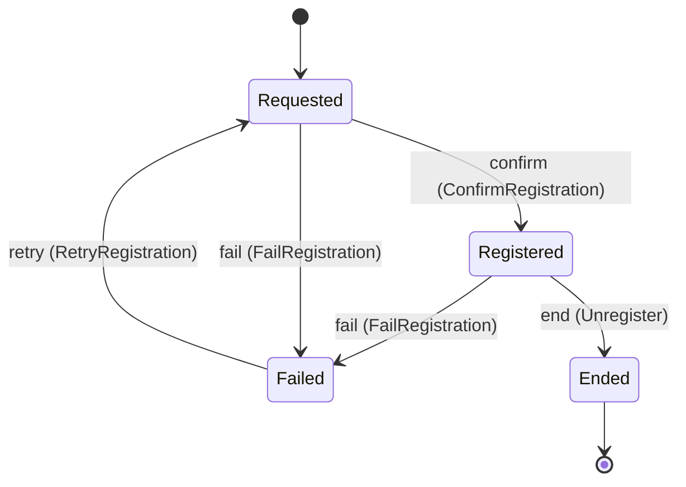
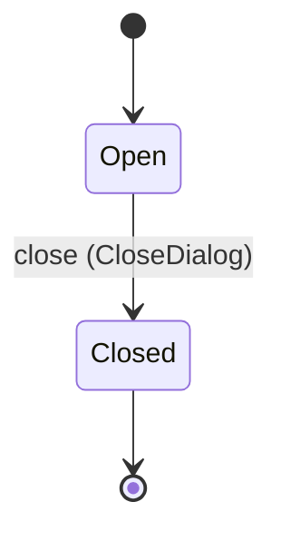

<!--
generated from softphone v1
model digest 3d66648c3a80c2b5ba8ed8e6e8d9bfcbe91e4312afd50f56a5fea9297e7297a6
contract digest e5f906a1766d3fb58368538db798106948f3652b704c383cabc1dccaaa49c82b
do not edit: regenerate with `ess generate`
-->

# SIP binding

A SIP registration and the dialogs carrying media sessions over it. The only domain that names SIP, SDP, an address-of-record or a WebSocket. The offer/answer exchange lives here as four commands and the two descriptions a dialog carries.

`softphone.sip` is one of softphone's bounded contexts. [Back to the index](../index.md).

## Types

### `AddressOfRecord`

`softphone.sip.AddressOfRecord` wraps `String` and is not interchangeable with one: the whole value of naming it separately is the crossings the model then refuses.

### `MediaSecurity`

`softphone.sip.MediaSecurity` is one of `DtlsSrtp`.

### `RegistrationId`

`softphone.sip.RegistrationId` wraps `Uuid` and is not interchangeable with one: the whole value of naming it separately is the crossings the model then refuses.

### `RegistrationRow`

`softphone.sip.RegistrationRow` is a record of four fields:

- `registration_id` — `softphone.sip.RegistrationId`
- `aor` — `softphone.sip.AddressOfRecord`
- `transport` — `softphone.sip.SignallingTransport`
- `state` — `softphone.sip.Registration.State`

### `SessionDescription`

`softphone.sip.SessionDescription` wraps `String` and is not interchangeable with one: the whole value of naming it separately is the crossings the model then refuses.

### `SignallingTransport`

`softphone.sip.SignallingTransport` is one of `SecureWebSocket`.

### `SipCause`

`softphone.sip.SipCause` wraps `String` and is not interchangeable with one: the whole value of naming it separately is the crossings the model then refuses.

### `SipDialogId`

`softphone.sip.SipDialogId` wraps `Uuid` and is not interchangeable with one: the whole value of naming it separately is the crossings the model then refuses.

### `SipDialogRow`

`softphone.sip.SipDialogRow` is a record of eight fields:

- `dialog_id` — `softphone.sip.SipDialogId`
- `session_id` — `softphone.media.MediaSessionId`
- `registration_id` — `softphone.sip.RegistrationId`
- `remote_uri` — `softphone.sip.SipUri`
- `media_security` — `softphone.sip.MediaSecurity`
- `local_sdp` — `Optional<softphone.sip.SessionDescription>`, which may be absent
- `remote_sdp` — `Optional<softphone.sip.SessionDescription>`, which may be absent
- `state` — `softphone.sip.SipDialog.State`

### `SipUri`

`softphone.sip.SipUri` wraps `String` and is not interchangeable with one: the whole value of naming it separately is the crossings the model then refuses.

Two of the types above are reached by nothing else in this system: `softphone.sip.RegistrationRow` and `softphone.sip.SipDialogRow`. No entity, view, command, event, error or crossing names them, so it is either vocabulary something outside this specification uses or a leftover — and only a person can tell which.

## Entities

An entity is what this context is about: something with an identity that outlives any one request, a shape, and a lifecycle. The lifecycle is exhaustive — a move that is not drawn below is a move this specification does not permit, and that is the only way it says so. Every move is labelled with the command that takes it, because a move nothing can trigger is refused rather than drawn.

### `Registration`

`softphone.sip.Registration`.

An instance is identified by `registration_id`, a `softphone.sip.RegistrationId`. The name is part of the model and not a convention: a view projects the identity under that name, so a projection inventing its own would disagree with the view.

It holds:

- `aor` — `softphone.sip.AddressOfRecord`
- `transport` — `softphone.sip.SignallingTransport`
- `expires` — `Duration`

It declares no relation to another entity, and no other entity names it.

No invariant is declared, so nothing here constrains an instance at rest.

Its state is a `softphone.sip.Registration.State`, one of `Ended`, `Failed`, `Registered` and `Requested`. That enum is synthesised from the lifecycle rather than declared beside it, so the states a view's filter compares and the states drawn below cannot disagree.

An instance is created in `Requested`. `Ended` is terminal, so an instance may rest there forever. That is declared rather than inferred from having no way out: an entity that cannot leave a state is either finished or stuck, and only its author knows which.

Each move is taken by a declared command outcome, and a move nothing takes is refused as `missing_causation` rather than left as a state change nobody can trigger:

- `confirm` — taken by `softphone.sip.ConfirmRegistration` on its `confirmed` outcome
- `fail` — taken by `softphone.sip.FailRegistration` on its `failed` outcome
- `retry` — taken by `softphone.sip.RetryRegistration` on its `retried` outcome
- `end` — taken by `softphone.sip.Unregister` on its `ended` outcome

An instance is brought into existence by `softphone.sip.Register` on its `requested` outcome.

Illegal transitions are illegal by absence: no rule forbids them, there is simply no arrow, because a rule would be a second place for the same truth to live. A diagram cannot show an absence, so the pairs it does not connect are listed here, derived from the same transitions — anything named below is a move this specification does not permit.

- `Ended` may not become `Failed`
- `Ended` may not become `Registered`
- `Ended` may not become `Requested`
- `Failed` may not become `Ended`
- `Failed` may not become `Registered`
- `Registered` may not become `Requested`
- `Requested` may not become `Ended`

One view projects it: [`RegistrationById`](#registrationbyid).

### `SipDialog`

`softphone.sip.SipDialog`.

An instance is identified by `dialog_id`, a `softphone.sip.SipDialogId`. The name is part of the model and not a convention: a view projects the identity under that name, so a projection inventing its own would disagree with the view.

It holds:

- `session_id` — `softphone.media.MediaSessionId`
- `registration_id` — `softphone.sip.RegistrationId`
- `remote_uri` — `softphone.sip.SipUri`
- `media_security` — `softphone.sip.MediaSecurity`
- `local_sdp` — `Optional<softphone.sip.SessionDescription>`, which may be absent
- `remote_sdp` — `Optional<softphone.sip.SessionDescription>`, which may be absent

It references at most one [`softphone.media.MediaSession`](softphone-media.md#mediasession), as `session`, carried by `SipDialog.session_id`.

No invariant is declared, so nothing here constrains an instance at rest.

Its state is a `softphone.sip.SipDialog.State`, one of `Closed` and `Open`. That enum is synthesised from the lifecycle rather than declared beside it, so the states a view's filter compares and the states drawn below cannot disagree.

An instance is created in `Open`. `Closed` is terminal, so an instance may rest there forever. That is declared rather than inferred from having no way out: an entity that cannot leave a state is either finished or stuck, and only its author knows which.

Each move is taken by a declared command outcome, and a move nothing takes is refused as `missing_causation` rather than left as a state change nobody can trigger:

- `close` — taken by `softphone.sip.CloseDialog` on its `closed` outcome

An instance is brought into existence by `softphone.sip.OpenDialog` on its `opened` outcome.

Illegal transitions are illegal by absence: no rule forbids them, there is simply no arrow, because a rule would be a second place for the same truth to live. A diagram cannot show an absence, so the pairs it does not connect are listed here, derived from the same transitions — anything named below is a move this specification does not permit.

- `Closed` may not become `Open`

One view projects it: [`SipDialogById`](#sipdialogbyid).

## Views

A view is what the outside world is promised it can observe. Each one says which instances it contains and how soon it reflects a command that has already returned, because "you can read this" without "how soon" is the promise every flaky suite is built on.

### `RegistrationById`

`softphone.sip.RegistrationById`, shown to a person as "Registration by id" and called `registration-by-id` on the wire.

It reads [`Registration`](#registration).

It contains the instances where `registration_id == param.registration_id` holds, and only those — so an instance a caller cannot find in here has been filtered out rather than lost.

It exposes:

- `registration_id` — `softphone.sip.RegistrationId`
- `aor` — `softphone.sip.AddressOfRecord`
- `transport` — `softphone.sip.SignallingTransport`
- `state` — `softphone.sip.Registration.State`

It declares no order, so the rows come back in whatever order the implementation has, and two reads may disagree.

**Read-your-writes**: it is current the moment the command that changed it returns. A caller that has just created an invoice and cannot see it in here has been told a lie about what it did.

A generated scenario asserts it once, immediately after the command: a view promising this and not keeping the promise has to fail the suite rather than be retried until it passes.

### `SipDialogById`

`softphone.sip.SipDialogById`, shown to a person as "SIP dialog by id" and called `sip-dialog-by-id` on the wire.

It reads [`SipDialog`](#sipdialog).

It contains the instances where `dialog_id == param.dialog_id` holds, and only those — so an instance a caller cannot find in here has been filtered out rather than lost.

It exposes:

- `dialog_id` — `softphone.sip.SipDialogId`
- `session_id` — `softphone.media.MediaSessionId`
- `registration_id` — `softphone.sip.RegistrationId`
- `remote_uri` — `softphone.sip.SipUri`
- `media_security` — `softphone.sip.MediaSecurity`
- `local_sdp` — `Optional<softphone.sip.SessionDescription>`, which may be absent
- `remote_sdp` — `Optional<softphone.sip.SessionDescription>`, which may be absent
- `state` — `softphone.sip.SipDialog.State`

It declares no order, so the rows come back in whatever order the implementation has, and two reads may disagree.

**Read-your-writes**: it is current the moment the command that changed it returns. A caller that has just created an invoice and cannot see it in here has been told a lie about what it did.

A generated scenario asserts it once, immediately after the command: a view promising this and not keeping the promise has to fail the suite rather than be retried until it passes.

## Commands

### `ApplyRemoteMedia`

`softphone.sip.ApplyRemoteMedia`, shown to a person as "Apply remote media" and called `apply-remote-media` on the wire.

Recorded at `sipx:docs/specs/browser-sdk.md#L370`.

It takes:

- `dialog_id` — `softphone.sip.SipDialogId`
- `sdp` — `softphone.sip.SessionDescription`

It has one outcome.

**`applied`** — The default branch, taken when no other outcome's condition matched. It changes a `softphone.sip.SipDialog` without moving it along its lifecycle. The instance is the one named by the input field `dialog_id`. It emits `softphone.sip.RemoteMediaApplied`. It sets `remote_sdp` from `input.sdp`. A test reaches it by constructing an input that satisfies no other outcome's condition.

### `CloseDialog`

`softphone.sip.CloseDialog`, shown to a person as "Close dialog" and called `close-dialog` on the wire.

It takes:

- `dialog_id` — `softphone.sip.SipDialogId`
- `session_id` — `softphone.media.MediaSessionId`
- `cause` — `softphone.sip.SipCause`
- `reason` — `softphone.media.TerminationReason`

It has two outcomes.

**`closed`** — The default branch, taken when no other outcome's condition matched. It moves a `softphone.sip.SipDialog` from `Open` to `Closed`, along the declared move `close`. The instance is the one named by the input field `dialog_id`. It emits `softphone.sip.SipDialogClosed`. A test reaches it by constructing an input that satisfies no other outcome's condition.

**`wrong-state`** — Taken when the subject is resting in a state none of this command's moves start from — a `softphone.sip.SipDialog` in `Closed`, which is what is left of the lifecycle once this command's own moves are taken away. The document lists none of it. No entity in this specification changes. It reports `softphone.sip.SipDialogStateConflict`, carrying `state`. It emits nothing. A test reaches it by driving an instance into one of those states and then issuing the command, because no input selects this branch.

### `ConfirmRegistration`

`softphone.sip.ConfirmRegistration`, shown to a person as "Confirm registration" and called `confirm-registration` on the wire.

It takes:

- `registration_id` — `softphone.sip.RegistrationId`

It has two outcomes.

**`confirmed`** — The default branch, taken when no other outcome's condition matched. It moves a `softphone.sip.Registration` from `Requested` to `Registered`, along the declared move `confirm`. The instance is the one named by the input field `registration_id`. It emits `softphone.sip.RegistrationConfirmed`. A test reaches it by constructing an input that satisfies no other outcome's condition.

**`wrong-state`** — Taken when the subject is resting in a state none of this command's moves start from — a `softphone.sip.Registration` in `Ended`, `Failed` and `Registered`, which is what is left of the lifecycle once this command's own moves are taken away. The document lists none of it. No entity in this specification changes. It reports `softphone.sip.RegistrationStateConflict`, carrying `state`. It emits nothing. A test reaches it by driving an instance into one of those states and then issuing the command, because no input selects this branch.

### `FailLocalMedia`

`softphone.sip.FailLocalMedia`, shown to a person as "Fail local media" and called `fail-local-media` on the wire.

Recorded at `sipx:docs/specs/browser-sdk.md#L352`.

It takes:

- `dialog_id` — `softphone.sip.SipDialogId`
- `cause` — `softphone.sip.SipCause`

It has one outcome.

**`failed`** — Negotiation did not produce media. The dialog is not moved here — `CloseDialog` ends it and `softphone.control.FailCall` is what tells the call, so a media failure never arrives as a SIP cause. The default branch, taken when no other outcome's condition matched. No entity in this specification changes. It emits `softphone.sip.LocalMediaFailed`. A test reaches it by constructing an input that satisfies no other outcome's condition.

### `FailRegistration`

`softphone.sip.FailRegistration`, shown to a person as "Fail registration" and called `fail-registration` on the wire.

It takes:

- `registration_id` — `softphone.sip.RegistrationId`
- `cause` — `softphone.sip.SipCause`

It has two outcomes.

**`failed`** — The default branch, taken when no other outcome's condition matched. It moves a `softphone.sip.Registration` from `Registered` and `Requested` to `Failed`, along the declared move `fail`. The instance is the one named by the input field `registration_id`. It emits `softphone.sip.RegistrationFailed`. A test reaches it by constructing an input that satisfies no other outcome's condition.

**`wrong-state`** — Taken when the subject is resting in a state none of this command's moves start from — a `softphone.sip.Registration` in `Ended` and `Failed`, which is what is left of the lifecycle once this command's own moves are taken away. The document lists none of it. No entity in this specification changes. It reports `softphone.sip.RegistrationStateConflict`, carrying `state`. It emits nothing. A test reaches it by driving an instance into one of those states and then issuing the command, because no input selects this branch.

### `OfferLocalMedia`

`softphone.sip.OfferLocalMedia`, shown to a person as "Offer local media" and called `offer-local-media` on the wire.

Recorded at `sipx:docs/specs/browser-sdk.md#L350`.

It takes:

- `dialog_id` — `softphone.sip.SipDialogId`
- `sdp` — `softphone.sip.SessionDescription`

It has one outcome.

**`offered`** — The default branch, taken when no other outcome's condition matched. It changes a `softphone.sip.SipDialog` without moving it along its lifecycle. The instance is the one named by the input field `dialog_id`. It emits `softphone.sip.LocalMediaOffered`. It sets `local_sdp` from `input.sdp`. A test reaches it by constructing an input that satisfies no other outcome's condition.

### `OpenDialog`

`softphone.sip.OpenDialog`, shown to a person as "Open dialog" and called `open-dialog` on the wire.

It takes:

- `session_id` — `softphone.media.MediaSessionId`
- `registration_id` — `softphone.sip.RegistrationId`
- `remote_uri` — `softphone.sip.SipUri`
- `media_security` — `softphone.sip.MediaSecurity`

It has one outcome.

**`opened`** — The only outcome that creates a `SipDialog`. This is what holds the binding discriminator on `softphone.media.MediaSession` honest — no invariant can. The default branch, taken when no other outcome's condition matched. It creates a `softphone.sip.SipDialog`, which starts in `Open`. The new instance's identity is published as `dialog_id` on `softphone.sip.SipDialogOpened`. It emits `softphone.sip.SipDialogOpened`. It sets `session_id` from `input.session_id`, `registration_id` from `input.registration_id`, `remote_uri` from `input.remote_uri` and `media_security` from `input.media_security`. A test reaches it by constructing an input that satisfies no other outcome's condition.

### `RefreshRegistration`

`softphone.sip.RefreshRegistration`, shown to a person as "Refresh registration" and called `refresh-registration` on the wire.

It takes:

- `registration_id` — `softphone.sip.RegistrationId`
- `expires` — `Duration`

It has one outcome.

**`refreshed`** — The default branch, taken when no other outcome's condition matched. It changes a `softphone.sip.Registration` without moving it along its lifecycle. The instance is the one named by the input field `registration_id`. It emits `softphone.sip.RegistrationRefreshed`. It sets `expires` from `input.expires`. A test reaches it by constructing an input that satisfies no other outcome's condition.

### `Register`

`softphone.sip.Register`, shown to a person as "Register" and called `register` on the wire.

Recorded at `sipx:docs/specs/browser-sdk.md#L341`.

It takes:

- `aor` — `softphone.sip.AddressOfRecord`
- `transport` — `softphone.sip.SignallingTransport`
- `expires` — `Duration`

It has one outcome.

**`requested`** — Requested; no SIP transaction has succeeded yet. The default branch, taken when no other outcome's condition matched. It creates a `softphone.sip.Registration`, which starts in `Requested`. The new instance's identity is published as `registration_id` on `softphone.sip.RegistrationRequested`. It emits `softphone.sip.RegistrationRequested`. It sets `aor` from `input.aor`, `transport` from `input.transport` and `expires` from `input.expires`. A test reaches it by constructing an input that satisfies no other outcome's condition.

### `RequestLocalMedia`

`softphone.sip.RequestLocalMedia`, shown to a person as "Request local media" and called `request-local-media` on the wire.

Recorded at `sipx:docs/specs/browser-sdk.md#L368`.

It takes:

- `dialog_id` — `softphone.sip.SipDialogId`

It has one outcome.

**`requested`** — The kernel is asking the browser for a description; nothing about the dialog changes. The default branch, taken when no other outcome's condition matched. No entity in this specification changes. It emits `softphone.sip.LocalMediaRequested`. A test reaches it by constructing an input that satisfies no other outcome's condition.

### `RetryRegistration`

`softphone.sip.RetryRegistration`, shown to a person as "Retry registration" and called `retry-registration` on the wire.

It takes:

- `registration_id` — `softphone.sip.RegistrationId`

It has two outcomes.

**`retried`** — The default branch, taken when no other outcome's condition matched. It moves a `softphone.sip.Registration` from `Failed` to `Requested`, along the declared move `retry`. The instance is the one named by the input field `registration_id`. It emits `softphone.sip.RegistrationRetried`. A test reaches it by constructing an input that satisfies no other outcome's condition.

**`wrong-state`** — Taken when the subject is resting in a state none of this command's moves start from — a `softphone.sip.Registration` in `Ended`, `Registered` and `Requested`, which is what is left of the lifecycle once this command's own moves are taken away. The document lists none of it. No entity in this specification changes. It reports `softphone.sip.RegistrationStateConflict`, carrying `state`. It emits nothing. A test reaches it by driving an instance into one of those states and then issuing the command, because no input selects this branch.

### `Unregister`

`softphone.sip.Unregister`, shown to a person as "Unregister" and called `unregister` on the wire.

It takes:

- `registration_id` — `softphone.sip.RegistrationId`

It has two outcomes.

**`ended`** — The default branch, taken when no other outcome's condition matched. It moves a `softphone.sip.Registration` from `Registered` to `Ended`, along the declared move `end`. The instance is the one named by the input field `registration_id`. It emits `softphone.sip.RegistrationEnded`. A test reaches it by constructing an input that satisfies no other outcome's condition.

**`wrong-state`** — Taken when the subject is resting in a state none of this command's moves start from — a `softphone.sip.Registration` in `Ended`, `Failed` and `Requested`, which is what is left of the lifecycle once this command's own moves are taken away. The document lists none of it. No entity in this specification changes. It reports `softphone.sip.RegistrationStateConflict`, carrying `state`. It emits nothing. A test reaches it by driving an instance into one of those states and then issuing the command, because no input selects this branch.

## Events

### `LocalMediaFailed`

`softphone.sip.LocalMediaFailed`.

It carries:

- `dialog_id` — `softphone.sip.SipDialogId`
- `cause` — `softphone.sip.SipCause`

Emitted by `softphone.sip.FailLocalMedia` on its `failed` outcome.

Nothing in this system reacts to it.

### `LocalMediaOffered`

`softphone.sip.LocalMediaOffered`.

It carries:

- `dialog_id` — `softphone.sip.SipDialogId`
- `sdp` — `softphone.sip.SessionDescription`

Emitted by `softphone.sip.OfferLocalMedia` on its `offered` outcome.

Nothing in this system reacts to it.

### `LocalMediaRequested`

`softphone.sip.LocalMediaRequested`.

It carries:

- `dialog_id` — `softphone.sip.SipDialogId`

Emitted by `softphone.sip.RequestLocalMedia` on its `requested` outcome.

Nothing in this system reacts to it.

### `RegistrationConfirmed`

`softphone.sip.RegistrationConfirmed`.

It carries:

- `registration_id` — `softphone.sip.RegistrationId`

Emitted by `softphone.sip.ConfirmRegistration` on its `confirmed` outcome.

Nothing in this system reacts to it.

### `RegistrationEnded`

`softphone.sip.RegistrationEnded`.

It carries:

- `registration_id` — `softphone.sip.RegistrationId`

Emitted by `softphone.sip.Unregister` on its `ended` outcome.

Nothing in this system reacts to it.

### `RegistrationFailed`

`softphone.sip.RegistrationFailed`.

It carries:

- `registration_id` — `softphone.sip.RegistrationId`
- `cause` — `softphone.sip.SipCause`

Emitted by `softphone.sip.FailRegistration` on its `failed` outcome.

Nothing in this system reacts to it.

### `RegistrationRefreshed`

`softphone.sip.RegistrationRefreshed`.

It carries:

- `registration_id` — `softphone.sip.RegistrationId`
- `expires` — `Duration`

Emitted by `softphone.sip.RefreshRegistration` on its `refreshed` outcome.

Nothing in this system reacts to it.

### `RegistrationRequested`

`softphone.sip.RegistrationRequested`.

It carries:

- `registration_id` — `softphone.sip.RegistrationId`
- `aor` — `softphone.sip.AddressOfRecord`
- `transport` — `softphone.sip.SignallingTransport`
- `expires` — `Duration`

Emitted by `softphone.sip.Register` on its `requested` outcome.

Nothing in this system reacts to it.

### `RegistrationRetried`

`softphone.sip.RegistrationRetried`.

It carries:

- `registration_id` — `softphone.sip.RegistrationId`

Emitted by `softphone.sip.RetryRegistration` on its `retried` outcome.

Nothing in this system reacts to it.

### `RemoteMediaApplied`

`softphone.sip.RemoteMediaApplied`.

It carries:

- `dialog_id` — `softphone.sip.SipDialogId`
- `sdp` — `softphone.sip.SessionDescription`

Emitted by `softphone.sip.ApplyRemoteMedia` on its `applied` outcome.

Nothing in this system reacts to it.

### `SipDialogClosed`

`softphone.sip.SipDialogClosed`.

It carries:

- `dialog_id` — `softphone.sip.SipDialogId`
- `session_id` — `softphone.media.MediaSessionId`
- `cause` — `softphone.sip.SipCause`
- `reason` — `softphone.media.TerminationReason`

Emitted by `softphone.sip.CloseDialog` on its `closed` outcome.

`end-session-with-dialog` reacts to it — see [Interactions](../interactions.md).

### `SipDialogOpened`

`softphone.sip.SipDialogOpened`.

It carries:

- `dialog_id` — `softphone.sip.SipDialogId`
- `session_id` — `softphone.media.MediaSessionId`
- `registration_id` — `softphone.sip.RegistrationId`
- `remote_uri` — `softphone.sip.SipUri`
- `media_security` — `softphone.sip.MediaSecurity`

Emitted by `softphone.sip.OpenDialog` on its `opened` outcome.

Nothing in this system reacts to it.

## Errors

### `RegistrationStateConflict`

The registration is not in a state from which the requested change is allowed.

It carries:

- `state` — `softphone.sip.Registration.State`

Reported by `softphone.sip.ConfirmRegistration` on its `wrong-state` outcome.

Reported by `softphone.sip.FailRegistration` on its `wrong-state` outcome.

Reported by `softphone.sip.RetryRegistration` on its `wrong-state` outcome.

Reported by `softphone.sip.Unregister` on its `wrong-state` outcome.

### `SipDialogStateConflict`

The dialog is not in a state from which the requested change is allowed.

It carries:

- `state` — `softphone.sip.SipDialog.State`

Reported by `softphone.sip.CloseDialog` on its `wrong-state` outcome.

## Actors

An actor is who may ask this context for something. Every grant below points at a command this specification declares — a grant is a resolved reference, so "may invoke" something nobody wrote is not a permission this model can express, and an authorisation that authorises nothing cannot ship quietly.

### `Kernel`

`softphone.sip.Kernel`, shown to a person as "Signalling kernel".

It may invoke [`ApplyRemoteMedia`](#applyremotemedia), [`CloseDialog`](#closedialog), [`ConfirmRegistration`](#confirmregistration), [`FailRegistration`](#failregistration) and [`RequestLocalMedia`](#requestlocalmedia).

### `SipHost`

`softphone.sip.SipHost`, shown to a person as "SIP host".

It may invoke [`CloseDialog`](#closedialog), [`FailLocalMedia`](#faillocalmedia), [`OfferLocalMedia`](#offerlocalmedia), [`OpenDialog`](#opendialog), [`RefreshRegistration`](#refreshregistration), [`Register`](#register), [`RetryRegistration`](#retryregistration) and [`Unregister`](#unregister).

---

Generated from softphone v1 · model digest `3d66648c3a80c2b5ba8ed8e6e8d9bfcbe91e4312afd50f56a5fea9297e7297a6` · contract digest `e5f906a1766d3fb58368538db798106948f3652b704c383cabc1dccaaa49c82b`. Do not edit this file; change the specification and regenerate it with `ess generate`.
