<!--
generated from softphone v1
model digest 3d66648c3a80c2b5ba8ed8e6e8d9bfcbe91e4312afd50f56a5fea9297e7297a6
contract digest b44b97c39f6c56280f3034e682da190a85a54d31c2b621422d55377b30a6864a
do not edit: regenerate with `ess generate`
-->

# softphone v1

A softphone in four layers: a protocol-neutral media session, a control surface a human or an agent drives identically, what it recorded and who it can call, and a presentation over both. Two bindings carry the media session, and neither appears in it.

## The system as a graph

```mermaid
flowchart TB
    subgraph who["who may ask"]
        who0["softphone.bridge.BridgeHost"]
        who1["softphone.bridge.Kernel"]
        who2["softphone.control.Agent"]
        who3["softphone.control.Human"]
        who4["softphone.control.Kernel"]
        who5["softphone.directory.Human"]
        who6["softphone.history.HistoryHost"]
        who7["softphone.history.Human"]
        who8["softphone.local.LocalHost"]
        who9["softphone.media.SessionHost"]
        who10["softphone.presentation.Human"]
        who11["softphone.sip.Kernel"]
        who12["softphone.sip.SipHost"]
    end
    subgraph unit0["bridge-binding"]
        cmd0["softphone.bridge.CloseBridge"]
        cmd1["softphone.bridge.ConfirmBridge"]
        cmd2["softphone.bridge.ConnectBridge"]
        cmd3["softphone.bridge.FailBridge"]
        evt0["softphone.bridge.BridgeClosed"]
        evt1["softphone.bridge.BridgeConfirmed"]
        evt2["softphone.bridge.BridgeConnecting"]
        evt3["softphone.bridge.BridgeFailed"]
    end
    subgraph unit1["call-history"]
        cmd23["softphone.history.AttributeRecord"]
        cmd24["softphone.history.DeleteRecord"]
        cmd25["softphone.history.RecordCall"]
        evt23["softphone.history.CallRecorded"]
        evt24["softphone.history.RecordAttributed"]
        evt25["softphone.history.RecordDeleted"]
    end
    subgraph unit2["local-binding"]
        cmd26["softphone.local.AttachLoopback"]
        cmd27["softphone.local.DetachLoopback"]
        evt26["softphone.local.LoopbackAttached"]
        evt27["softphone.local.LoopbackDetached"]
    end
    subgraph unit3["media-session"]
        cmd28["softphone.media.ActivateSession"]
        cmd29["softphone.media.InterruptOutput"]
        cmd30["softphone.media.OpenSession"]
        cmd31["softphone.media.ReceiveSignal"]
        cmd32["softphone.media.SendSignal"]
        cmd33["softphone.media.TerminateSession"]
        evt28["softphone.media.OutputInterrupted"]
        evt29["softphone.media.SessionActivated"]
        evt30["softphone.media.SessionOpened"]
        evt31["softphone.media.SessionTerminated"]
        evt32["softphone.media.SignalReceived"]
        evt33["softphone.media.SignalSent"]
    end
    subgraph unit4["phone-console"]
        cmd34["softphone.presentation.AttributeTile"]
        cmd35["softphone.presentation.ClearEntry"]
        cmd36["softphone.presentation.DismissCall"]
        cmd42["softphone.presentation.OpenKeypad"]
        cmd43["softphone.presentation.PressKey"]
        cmd44["softphone.presentation.ShowCall"]
        evt34["softphone.presentation.CallDismissed"]
        evt35["softphone.presentation.CallShown"]
        evt41["softphone.presentation.EntryCleared"]
        evt42["softphone.presentation.KeyPressed"]
        evt43["softphone.presentation.KeypadOpened"]
        evt44["softphone.presentation.TileAttributed"]
    end
    subgraph unit5["phone-control"]
        cmd4["softphone.control.Answer"]
        cmd5["softphone.control.AttachMedia"]
        cmd6["softphone.control.ConfigureEndpoint"]
        cmd7["softphone.control.ConfirmAnswer"]
        cmd8["softphone.control.Dial"]
        cmd9["softphone.control.FailCall"]
        cmd10["softphone.control.HangUp"]
        cmd11["softphone.control.MediaConnected"]
        cmd12["softphone.control.OfferCall"]
        cmd13["softphone.control.Reject"]
        cmd14["softphone.control.RingCall"]
        cmd15["softphone.control.SendDigits"]
        cmd16["softphone.control.SetHeld"]
        cmd17["softphone.control.SetMuted"]
        evt4["softphone.control.CallAnswered"]
        evt5["softphone.control.CallConfirmed"]
        evt6["softphone.control.CallDialled"]
        evt7["softphone.control.CallEstablished"]
        evt8["softphone.control.CallFailed"]
        evt9["softphone.control.CallHungUp"]
        evt10["softphone.control.CallOffered"]
        evt11["softphone.control.CallRejected"]
        evt12["softphone.control.CallRinging"]
        evt13["softphone.control.DigitsSent"]
        evt14["softphone.control.EndpointConfigured"]
        evt15["softphone.control.HoldChanged"]
        evt16["softphone.control.MediaAttached"]
        evt17["softphone.control.MuteChanged"]
    end
    subgraph unit6["phone-directory"]
        cmd18["softphone.directory.AddAddress"]
        cmd19["softphone.directory.AddContact"]
        cmd20["softphone.directory.DeleteContact"]
        cmd21["softphone.directory.RemoveAddress"]
        cmd22["softphone.directory.RenameContact"]
        evt18["softphone.directory.ContactAdded"]
        evt19["softphone.directory.ContactAddressAdded"]
        evt20["softphone.directory.ContactAddressRemoved"]
        evt21["softphone.directory.ContactDeleted"]
        evt22["softphone.directory.ContactRenamed"]
    end
    subgraph unit7["sip-binding"]
        cmd45["softphone.sip.ApplyRemoteMedia"]
        cmd46["softphone.sip.CloseDialog"]
        cmd47["softphone.sip.ConfirmRegistration"]
        cmd48["softphone.sip.FailLocalMedia"]
        cmd49["softphone.sip.FailRegistration"]
        cmd50["softphone.sip.OfferLocalMedia"]
        cmd51["softphone.sip.OpenDialog"]
        cmd52["softphone.sip.RefreshRegistration"]
        cmd53["softphone.sip.Register"]
        cmd54["softphone.sip.RequestLocalMedia"]
        cmd55["softphone.sip.RetryRegistration"]
        cmd56["softphone.sip.Unregister"]
        evt45["softphone.sip.LocalMediaFailed"]
        evt46["softphone.sip.LocalMediaOffered"]
        evt47["softphone.sip.LocalMediaRequested"]
        evt48["softphone.sip.RegistrationConfirmed"]
        evt49["softphone.sip.RegistrationEnded"]
        evt50["softphone.sip.RegistrationFailed"]
        evt51["softphone.sip.RegistrationRefreshed"]
        evt52["softphone.sip.RegistrationRequested"]
        evt53["softphone.sip.RegistrationRetried"]
        evt54["softphone.sip.RemoteMediaApplied"]
        evt55["softphone.sip.SipDialogClosed"]
        evt56["softphone.sip.SipDialogOpened"]
    end
    subgraph unowned["owned by no component"]
        cmd37["softphone.presentation.EnterCall"]
        cmd38["softphone.presentation.EnterDialing"]
        cmd39["softphone.presentation.EnterIncoming"]
        cmd40["softphone.presentation.LeaveCall"]
        cmd41["softphone.presentation.OpenConsole"]
        evt36["softphone.presentation.ConsoleDialing"]
        evt37["softphone.presentation.ConsoleEngaged"]
        evt38["softphone.presentation.ConsoleIncoming"]
        evt39["softphone.presentation.ConsoleOpened"]
        evt40["softphone.presentation.ConsoleReleased"]
    end
    who0 -->|"may invoke"| cmd0
    who0 -->|"may invoke"| cmd2
    who1 -->|"may invoke"| cmd1
    who1 -->|"may invoke"| cmd3
    who2 -->|"may invoke"| cmd4
    who2 -->|"may invoke"| cmd6
    who2 -->|"may invoke"| cmd8
    who2 -->|"may invoke"| cmd10
    who2 -->|"may invoke"| cmd13
    who2 -->|"may invoke"| cmd15
    who2 -->|"may invoke"| cmd16
    who2 -->|"may invoke"| cmd17
    who3 -->|"may invoke"| cmd4
    who3 -->|"may invoke"| cmd6
    who3 -->|"may invoke"| cmd8
    who3 -->|"may invoke"| cmd10
    who3 -->|"may invoke"| cmd13
    who3 -->|"may invoke"| cmd15
    who3 -->|"may invoke"| cmd16
    who3 -->|"may invoke"| cmd17
    who4 -->|"may invoke"| cmd5
    who4 -->|"may invoke"| cmd7
    who4 -->|"may invoke"| cmd9
    who4 -->|"may invoke"| cmd11
    who4 -->|"may invoke"| cmd12
    who4 -->|"may invoke"| cmd14
    who5 -->|"may invoke"| cmd18
    who5 -->|"may invoke"| cmd19
    who5 -->|"may invoke"| cmd20
    who5 -->|"may invoke"| cmd21
    who5 -->|"may invoke"| cmd22
    who6 -->|"may invoke"| cmd25
    who7 -->|"may invoke"| cmd23
    who7 -->|"may invoke"| cmd24
    who8 -->|"may invoke"| cmd26
    who8 -->|"may invoke"| cmd27
    who9 -->|"may invoke"| cmd28
    who9 -->|"may invoke"| cmd29
    who9 -->|"may invoke"| cmd30
    who9 -->|"may invoke"| cmd31
    who9 -->|"may invoke"| cmd32
    who9 -->|"may invoke"| cmd33
    who10 -->|"may invoke"| cmd34
    who10 -->|"may invoke"| cmd35
    who10 -->|"may invoke"| cmd36
    who10 -->|"may invoke"| cmd37
    who10 -->|"may invoke"| cmd38
    who10 -->|"may invoke"| cmd39
    who10 -->|"may invoke"| cmd40
    who10 -->|"may invoke"| cmd41
    who10 -->|"may invoke"| cmd42
    who10 -->|"may invoke"| cmd43
    who10 -->|"may invoke"| cmd44
    who11 -->|"may invoke"| cmd45
    who11 -->|"may invoke"| cmd46
    who11 -->|"may invoke"| cmd47
    who11 -->|"may invoke"| cmd49
    who11 -->|"may invoke"| cmd54
    who12 -->|"may invoke"| cmd46
    who12 -->|"may invoke"| cmd48
    who12 -->|"may invoke"| cmd50
    who12 -->|"may invoke"| cmd51
    who12 -->|"may invoke"| cmd52
    who12 -->|"may invoke"| cmd53
    who12 -->|"may invoke"| cmd55
    who12 -->|"may invoke"| cmd56
    cmd0 -->|"closed"| evt0
    cmd1 -->|"confirmed"| evt1
    cmd2 -->|"connecting"| evt2
    cmd3 -->|"failed"| evt3
    cmd4 -->|"answered"| evt4
    cmd5 -->|"attached"| evt16
    cmd6 -->|"configured"| evt14
    cmd7 -->|"confirmed"| evt5
    cmd8 -->|"dialled"| evt6
    cmd9 -->|"failed"| evt8
    cmd10 -->|"hung-up"| evt9
    cmd11 -->|"established"| evt7
    cmd12 -->|"offered"| evt10
    cmd13 -->|"rejected"| evt11
    cmd14 -->|"ringing"| evt12
    cmd15 -->|"sent"| evt13
    cmd16 -->|"changed"| evt15
    cmd17 -->|"changed"| evt17
    cmd18 -->|"added"| evt19
    cmd19 -->|"added"| evt18
    cmd20 -->|"deleted"| evt21
    cmd21 -->|"removed"| evt20
    cmd22 -->|"renamed"| evt22
    cmd23 -->|"attributed"| evt24
    cmd24 -->|"deleted"| evt25
    cmd25 -->|"recorded"| evt23
    cmd26 -->|"attached"| evt26
    cmd27 -->|"detached"| evt27
    cmd28 -->|"activated"| evt29
    cmd29 -->|"interrupted"| evt28
    cmd30 -->|"opened"| evt30
    cmd31 -->|"received"| evt32
    cmd32 -->|"sent"| evt33
    cmd33 -->|"terminated"| evt31
    cmd34 -->|"attributed"| evt44
    cmd35 -->|"cleared"| evt41
    cmd36 -->|"dismissed"| evt34
    cmd37 -->|"engaged"| evt37
    cmd38 -->|"dialing"| evt36
    cmd39 -->|"incoming"| evt38
    cmd40 -->|"released"| evt40
    cmd41 -->|"opened"| evt39
    cmd42 -->|"opened"| evt43
    cmd43 -->|"pressed"| evt42
    cmd44 -->|"shown"| evt35
    cmd45 -->|"applied"| evt54
    cmd46 -->|"closed"| evt55
    cmd47 -->|"confirmed"| evt48
    cmd48 -->|"failed"| evt45
    cmd49 -->|"failed"| evt50
    cmd50 -->|"offered"| evt46
    cmd51 -->|"opened"| evt56
    cmd52 -->|"refreshed"| evt51
    cmd53 -->|"requested"| evt52
    cmd54 -->|"requested"| evt47
    cmd55 -->|"retried"| evt53
    cmd56 -->|"ended"| evt49
    evt1 -.->|"activate-session-with-bridge"| cmd28
    evt0 -.->|"end-session-with-bridge"| cmd33
    evt55 -.->|"end-session-with-dialog"| cmd33
    evt3 -.->|"end-session-with-failed-bridge"| cmd33
    evt27 -.->|"end-session-with-loopback"| cmd33
    evt8 -.->|"record-failed-call"| cmd25
    evt9 -.->|"record-hung-up-call"| cmd25
    evt11 -.->|"record-rejected-call"| cmd25
    evt10 -.->|"show-incoming-call"| cmd44
    evt6 -.->|"show-outbound-call"| cmd44
```

A command is accepted by the component that owns its context, emits the events one of its outcomes declares, and a dashed edge is a binding carrying an event into the next command. Design §9 begins one step earlier, at the actor who invokes the first command, and so does this graph: a solid edge out of an actor is a grant, and an actor drawn with no edge at all may invoke nothing — which is something the model says, not an arrow somebody forgot.

## Bounded contexts

- **[Media bridge](domains/softphone-bridge.md)** (`softphone.bridge`) — One media bridge from this phone to the server that holds its SIP leg: where it points, the offer it sent, the answer it got and why it closed. No SIP construct appears here. Five types, one entity, two views, four commands, four events, one error and two actors.
- **[Phone control](domains/softphone-control.md)** (`softphone.control`) — Calls this phone is placing or receiving, and the commands a human or an agent issues identically to drive them. No protocol type and no contact appears here. Nine types, two entities, three views, 14 commands, 14 events, one error and three actors.
- **[Phonebook](domains/softphone-directory.md)** (`softphone.directory`) — Contacts and the addresses they can be reached at. Owned by the person using the phone; the control surface never names a contact. Five types, two entities, three views, five commands, five events, two errors and one actor.
- **[Call history](domains/softphone-history.md)** (`softphone.history`) — One durable record per finished call, in the neutral termination vocabulary, optionally attributed to a contact. Deleted one record at a time; there is no bulk erase. Two types, one entity, two views, three commands, three events, one error and two actors.
- **[Local binding](domains/softphone-local.md)** (`softphone.local`) — A media session carried by local audio devices. No network, no signalling, no registration — the binding whose existence is the evidence that the media layer is not the SIP layer. Three types, one entity, one view, two commands, two events, one error and one actor.
- **[Media session](domains/softphone-media.md)** (`softphone.media`) — One admitted media session, its neutral audio profile, the signals crossing it and the one reason it ended. Agnostic to SIP, RTVBP and WebRTC by construction: no relation and no field type here points at a binding domain. 11 types, one entity, two views, six commands, six events, one error and one actor.
- **[Phone console](domains/softphone-presentation.md)** (`softphone.presentation`) — A keypad holding a partially typed address, and one tile per call carrying the contact name to show. The only domain a page reads directly. Six types, three entities, three views, 11 commands, 11 events, two errors and one actor.
- **[SIP binding](domains/softphone-sip.md)** (`softphone.sip`) — A SIP registration and the dialogs carrying media sessions over it. The only domain that names SIP, SDP, an address-of-record or a WebSocket. The offer/answer exchange lives here as four commands and the two descriptions a dialog carries. 10 types, two entities, two views, 12 commands, 12 events, two errors and two actors.

## Components

A component is a unit of ownership, not a deployment. How many of each runs, and what each needs, is [the topology](topology.md).

**`bridge-binding`** — Owns the bridge from this page to the server that holds its SIP leg. It owns [`softphone.bridge`](domains/softphone-bridge.md). It accepts `softphone.bridge.CloseBridge`, `softphone.bridge.ConfirmBridge`, `softphone.bridge.ConnectBridge` and `softphone.bridge.FailBridge`. It publishes `softphone.bridge.BridgeClosed`, `softphone.bridge.BridgeConfirmed`, `softphone.bridge.BridgeConnecting` and `softphone.bridge.BridgeFailed`.

**`call-history`** — Owns the durable record of every finished call. It owns [`softphone.history`](domains/softphone-history.md). It accepts `softphone.history.AttributeRecord`, `softphone.history.DeleteRecord` and `softphone.history.RecordCall`. It publishes `softphone.history.CallRecorded`, `softphone.history.RecordAttributed` and `softphone.history.RecordDeleted`.

**`local-binding`** — Owns the local-audio binding, the second carrier the media layer is proved against. It owns [`softphone.local`](domains/softphone-local.md). It accepts `softphone.local.AttachLoopback` and `softphone.local.DetachLoopback`. It publishes `softphone.local.LoopbackAttached` and `softphone.local.LoopbackDetached`.

**`media-session`** — Owns the protocol-neutral media session and the signals crossing it. It owns [`softphone.media`](domains/softphone-media.md). It accepts `softphone.media.ActivateSession`, `softphone.media.InterruptOutput`, `softphone.media.OpenSession`, `softphone.media.ReceiveSignal`, `softphone.media.SendSignal` and `softphone.media.TerminateSession`. It publishes `softphone.media.OutputInterrupted`, `softphone.media.SessionActivated`, `softphone.media.SessionOpened`, `softphone.media.SessionTerminated`, `softphone.media.SignalReceived` and `softphone.media.SignalSent`.

**`phone-console`** — Owns what is on screen and what a gesture means. It owns [`softphone.presentation`](domains/softphone-presentation.md). It accepts `softphone.presentation.AttributeTile`, `softphone.presentation.ClearEntry`, `softphone.presentation.DismissCall`, `softphone.presentation.OpenKeypad`, `softphone.presentation.PressKey` and `softphone.presentation.ShowCall`. It publishes `softphone.presentation.CallDismissed`, `softphone.presentation.CallShown`, `softphone.presentation.EntryCleared`, `softphone.presentation.KeyPressed`, `softphone.presentation.KeypadOpened` and `softphone.presentation.TileAttributed`.

**`phone-control`** — Owns the call surface a human or an agent drives identically. It owns [`softphone.control`](domains/softphone-control.md). It accepts `softphone.control.Answer`, `softphone.control.AttachMedia`, `softphone.control.ConfigureEndpoint`, `softphone.control.ConfirmAnswer`, `softphone.control.Dial`, `softphone.control.FailCall`, `softphone.control.HangUp`, `softphone.control.MediaConnected`, `softphone.control.OfferCall`, `softphone.control.Reject`, `softphone.control.RingCall`, `softphone.control.SendDigits`, `softphone.control.SetHeld` and `softphone.control.SetMuted`. It publishes `softphone.control.CallAnswered`, `softphone.control.CallConfirmed`, `softphone.control.CallDialled`, `softphone.control.CallEstablished`, `softphone.control.CallFailed`, `softphone.control.CallHungUp`, `softphone.control.CallOffered`, `softphone.control.CallRejected`, `softphone.control.CallRinging`, `softphone.control.DigitsSent`, `softphone.control.EndpointConfigured`, `softphone.control.HoldChanged`, `softphone.control.MediaAttached` and `softphone.control.MuteChanged`.

**`phone-directory`** — Owns the phonebook. It owns [`softphone.directory`](domains/softphone-directory.md). It accepts `softphone.directory.AddAddress`, `softphone.directory.AddContact`, `softphone.directory.DeleteContact`, `softphone.directory.RemoveAddress` and `softphone.directory.RenameContact`. It publishes `softphone.directory.ContactAdded`, `softphone.directory.ContactAddressAdded`, `softphone.directory.ContactAddressRemoved`, `softphone.directory.ContactDeleted` and `softphone.directory.ContactRenamed`.

**`sip-binding`** — Owns the SIP registration and the dialogs carrying media sessions over it. It owns [`softphone.sip`](domains/softphone-sip.md). It accepts `softphone.sip.ApplyRemoteMedia`, `softphone.sip.CloseDialog`, `softphone.sip.ConfirmRegistration`, `softphone.sip.FailLocalMedia`, `softphone.sip.FailRegistration`, `softphone.sip.OfferLocalMedia`, `softphone.sip.OpenDialog`, `softphone.sip.RefreshRegistration`, `softphone.sip.Register`, `softphone.sip.RequestLocalMedia`, `softphone.sip.RetryRegistration` and `softphone.sip.Unregister`. It publishes `softphone.sip.LocalMediaFailed`, `softphone.sip.LocalMediaOffered`, `softphone.sip.LocalMediaRequested`, `softphone.sip.RegistrationConfirmed`, `softphone.sip.RegistrationEnded`, `softphone.sip.RegistrationFailed`, `softphone.sip.RegistrationRefreshed`, `softphone.sip.RegistrationRequested`, `softphone.sip.RegistrationRetried`, `softphone.sip.RemoteMediaApplied`, `softphone.sip.SipDialogClosed` and `softphone.sip.SipDialogOpened`.

## The other pages

| page | what is on it |
|---|---|
| [Media bridge](domains/softphone-bridge.md) | the `softphone.bridge` vocabulary: its types, entities, views, commands, events, errors and actors |
| [Phone control](domains/softphone-control.md) | the `softphone.control` vocabulary: its types, entities, views, commands, events, errors and actors |
| [Phonebook](domains/softphone-directory.md) | the `softphone.directory` vocabulary: its types, entities, views, commands, events, errors and actors |
| [Call history](domains/softphone-history.md) | the `softphone.history` vocabulary: its types, entities, views, commands, events, errors and actors |
| [Local binding](domains/softphone-local.md) | the `softphone.local` vocabulary: its types, entities, views, commands, events, errors and actors |
| [Media session](domains/softphone-media.md) | the `softphone.media` vocabulary: its types, entities, views, commands, events, errors and actors |
| [Phone console](domains/softphone-presentation.md) | the `softphone.presentation` vocabulary: its types, entities, views, commands, events, errors and actors |
| [SIP binding](domains/softphone-sip.md) | the `softphone.sip` vocabulary: its types, entities, views, commands, events, errors and actors |
| [Interactions](interactions.md) | every binding, with what it guarantees and what happens when it fails |
| [Type crossings](crossings.md) | every conversion this system permits, and the reason someone gave for it |
| [Topology](topology.md) | what each component needs in order to run |

---

Generated from softphone v1 · model digest `3d66648c3a80c2b5ba8ed8e6e8d9bfcbe91e4312afd50f56a5fea9297e7297a6` · contract digest `b44b97c39f6c56280f3034e682da190a85a54d31c2b621422d55377b30a6864a`. Do not edit this file; change the specification and regenerate it with `ess generate`.
